## 开发指南

## 导入随心播代码

 随心播工程是Android Studio构建的，代码托管在github上

版本库地址 [https://github.com/zhaoyang21cn/Android\_Suixinbo.git](https://github.com/zhaoyang21cn/Android_Suixinbo.git)

本地导入随心播工程

1 打开命令行 输入

 git clone https://github.com/zhaoyang21cn/Android\_Suixinbo.git

2 用Android Studio 打开下载的目录

3 按照github 说明文档 配置工程版本库

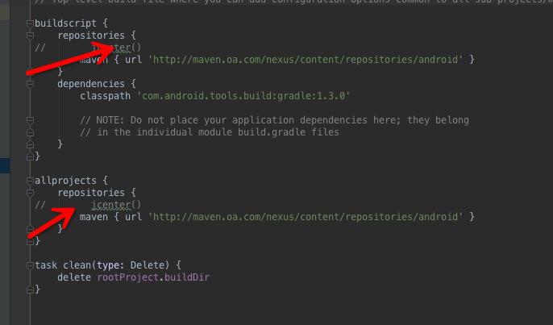

配置自己对应的SDK版本

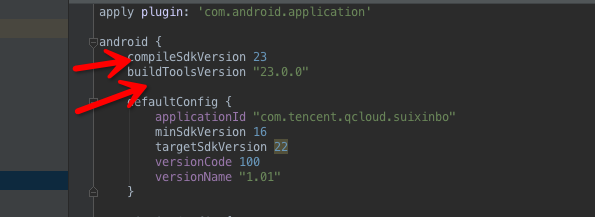
如果第一次，它可能需要导入一些第三方jar包，请耐心等待一些时间。

## 随心播框架

### 应用框架

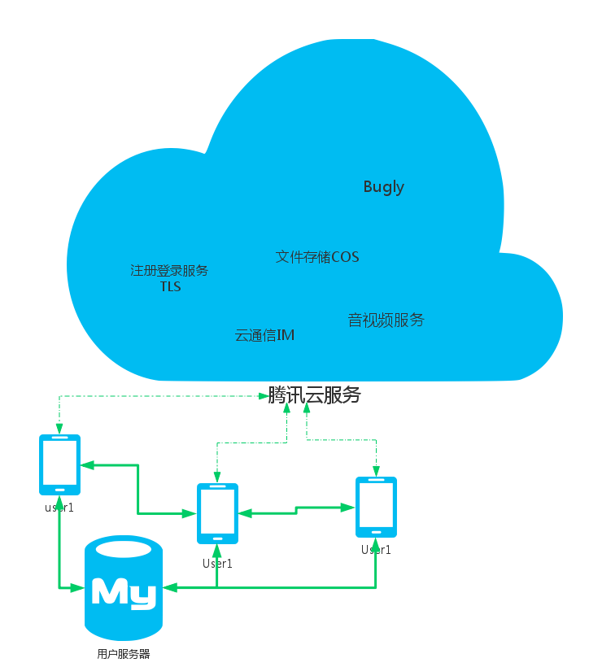
随心播就是利用腾讯云提供的云服务（主要是云通信和音视频）构建的一个视频直播类应用。DEMO实现的是手机上的软件层。包括支持云通信模块IMSDK，支持音视频模块AVSDK，云存储的模块COS（可选），帐号注册服务模块TLS和日志上报SDK（可选）。随心播代码的核心整合IMSDK 和AVSDK 进行视频直播。IMSDK负责整个消息系统，AVSDK负责音视频数据。

用户服务器主要任务是分配房间ID，维护直播列表。个人资料信息可以通过用户服务器维护。也可以托管给云通信（IMSDK）后台。随心播目前做法的是后者。用户服务器由客户方维护。腾讯提供开源代码参考。

[https://github.com/zhaoyang21cn/SuiXinBoPHPServer.git](https://github.com/zhaoyang21cn/SuiXinBoPHPServer.git)

### 代码框架

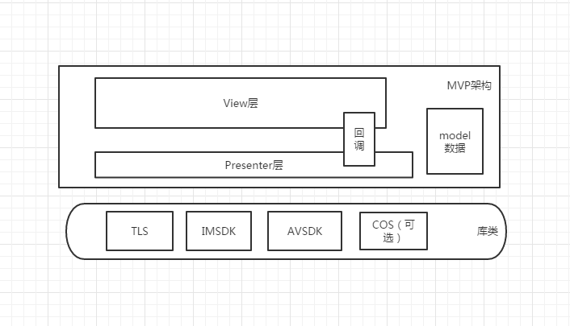
**Android代码采用主流MVP架构**

        **Views：** 所有界面类，包括登录、主界面、直播界面以及一些自定义控件。

**Presenters：** 所有界面的逻辑操作，包括初始化逻辑，进出房间逻辑，直播交互逻辑，登录逻辑等。以及逻辑操作的回调接口，这些接口会被需要对应功能的界面实现。

**Model：** 数据类包括当前房间信息类，个人状态类，文本消息类，AV成员类。

**AVControllers：** 里面保留了AVSDK一些操作类包括显示控制类，界面渲染类

**典型MVP操作流程示例** ： View有某些功能，持有对应功能的Presenter类，View触发功能，调用对应的Persenter方法，Presenter将处理结果通过ViewInface接口类回调给对应的View. View根据数据进行界面显示。 View类只做界面相关事情，数据逻辑都丢给Presenter处理。

**直播房间** 是由IMSDK的聊天室（AVChatRoom）和AVSDK的音视频房间（AVROOM）共同组成的。两者生命周期一致，创建房间就是创建一个聊天室同时创建一个音视频房间。聊天室负责直播过程中消息，包括群消息，C2C消息。文本消息，点赞，以及一些互动邀请和应答信令都是通过IMSDK的消息来实现的。音视频房间负责直播过程中音视频数据。利用成员状态的回调来请求成员音视频，虽然它也有成员上下线通知（房间成员过大不准），但一般用IMSDK消息来维护群成员。

IMSDK消息：成员进出群通知，互动邀请与应答，点赞，文本消息，群解散消息。

AVSDK回调 ：直播中成员音视频状态变化

## 初始化SDK

 通信模块，帐号模块，音视频模块都必须要初始化之后才能使用。模块初始化步骤都集中在InitusinessHelper这个类的initApp方法中。帐号的重复登录踢出机制，票据过期重新登录机制 也在本类中处理。

## 帐号登录

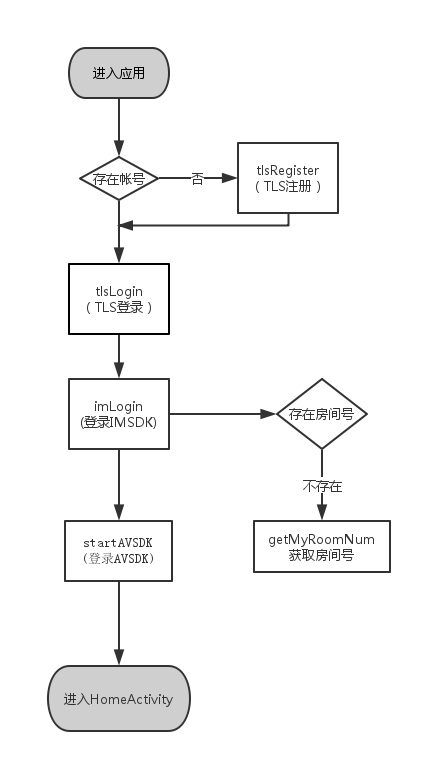
1.
  1. a)随心播帐号采用的TLS String帐号托管方式的。TLS也支持其他包括手机微信QQ以及自定义方式等。具体请参考腾讯云官网TLSDEMO
  2. b)房间号是用户服务器根据ID分配一个固定值（int型，因为AV房间必须是int）,IM聊天室Id和AV房间Id目前是一个值，只不过前者是String后者是int。
  3. c)初始化AVSDK方法（startAVSDK）必须等IM登录完成才行，不能倒置。

## 配置后台参数(角色与权限)

在直播房间中，每个成员的音视频的参数，网络参数是可以配置的。

配置地址 [http://console.qcloud.com/ilvb](http://console.qcloud.com/ilvb)

可以定义几个模版角色。不同的模版角色配置不同的音视频网络参数。用户可以在直播过程中动态切换。

随心播设计了三个角色

1. **主播角色** 权限全开 低延时 高分辨率

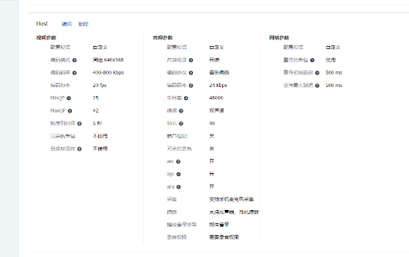
1. **普通成员角色** 高延时 只有接受的权限没有发送权限

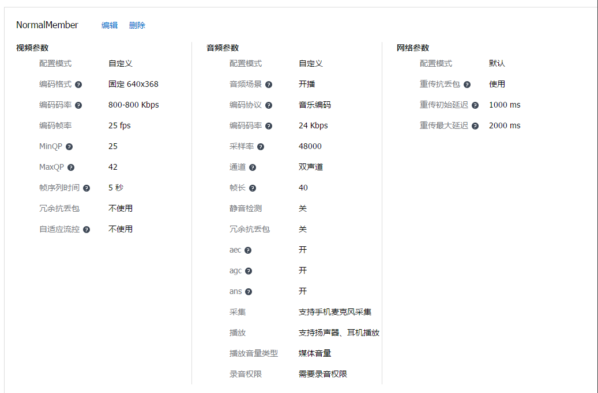
1. **互动观众角色** 低延时 低分辨率

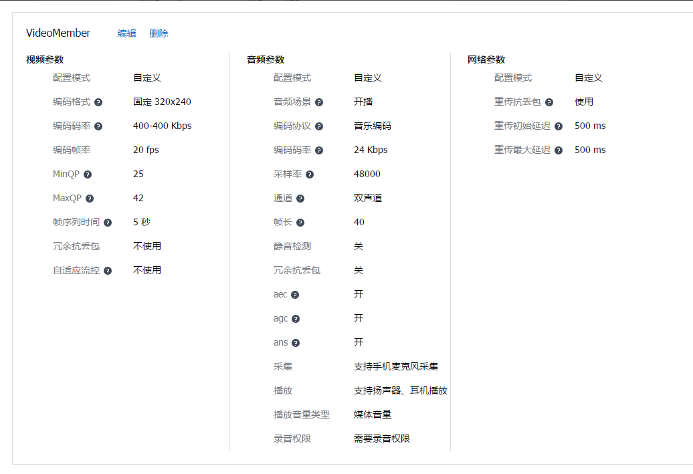
进入房间可以预设自己的角色

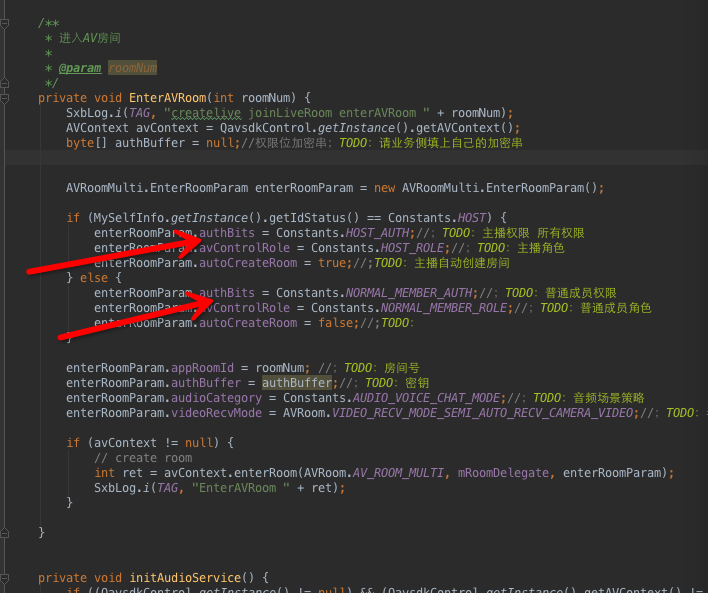
在直播过程中也可以动态调整自己的角色 参考LiveHelper的方法 changeRole

权限 是指的成员的上下行权限，有9种权限。默认权限是全开权限

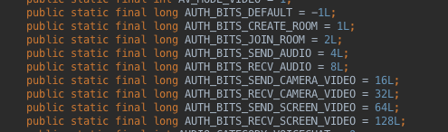
进入房间可以设置自己的进房间权限参考上图，在直播过程中也可以动态改变权限 参考LiveHelper中的方法changeAuthority

## 主播创建房间流程

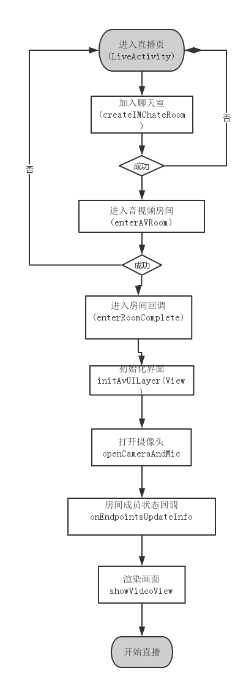
1. a)直播房间是由聊天室（AVChatRoom）和音视频房间（AVROOm）共同构成，创建一个直播就是创建一个聊天室，加入一个音视频房间。音视频房间没有创建的概念。
2. b)必须的进入房间之后才能初始化界面（initAvUILayer），初始化完了之后才能打开摄像头(openCameraAndMic)。
3. c)主播渲染，无需向AV后台请求自己画面，设置自己ID( setSelfId )，本地渲染(setLocalHasVideo)即可。设置ID和本地渲染也不能逆序。

## 推流与录制

录制在客户端就是发起一个请求而已。SDK会自动上传音视频流

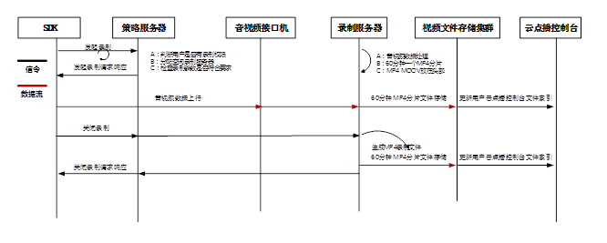
接口示例

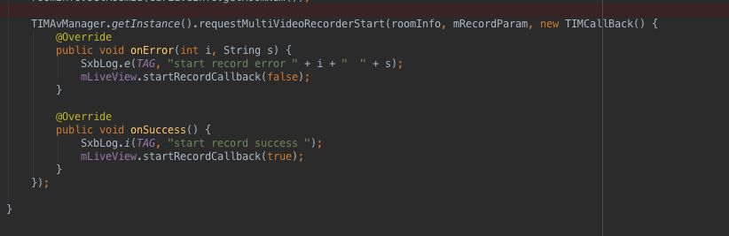
旁路推流类似录制，客户端只需发起一个请求而已

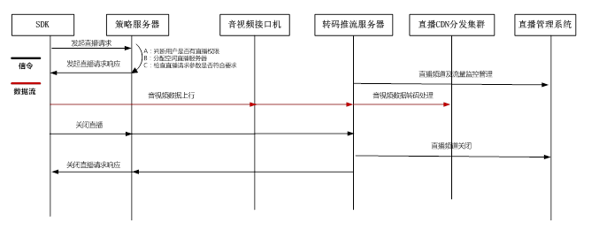
接口示例

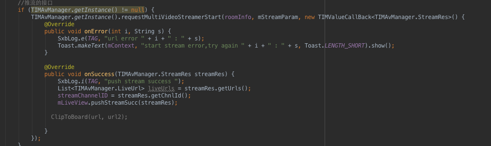
关于录制和旁路推流的更多内容请关注腾讯云上面的文档

## 观众加入房间

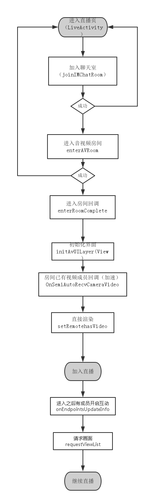
1. a)加入聊天室，进入音视频房间
2. b)加入房间初始，通过监听OnSemiAutoRecvCameraVideo来判断已经加入房间互动观众，直接渲染互动观众画面的，无需请求，这个步骤是优化进入房间速度的。进入房间后直播过程中如果成员状态变化，通过onEndpointsUpdateInfo需要请求对方画面，再渲染。
3. c)如果摄像头变化的是自己，直接本地渲染就可以了，无需请求。

## 消息互动

创建房间的时候先创建IM聊天室 就是为了给音视频房间房间的配置一个信令系统。

文本消息 ：所有人同步，采用IM的群消息接口

关注，邀请消息 ：单独制定接收方，可以采用IM的C2C消息接口

赞 礼物 等类似业务方可以根据需求自己决定采用那种消息通道

C2C消息

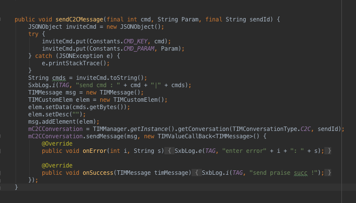
群消息

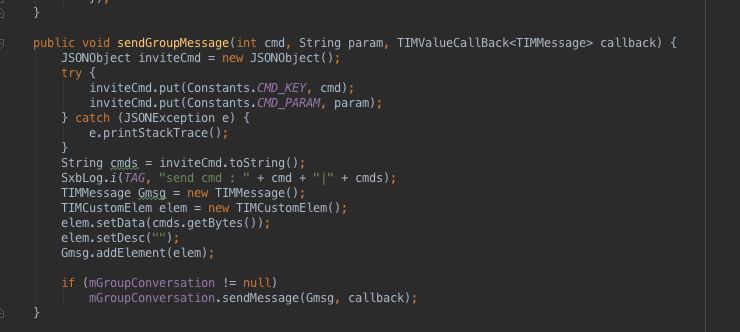
## 连麦互动

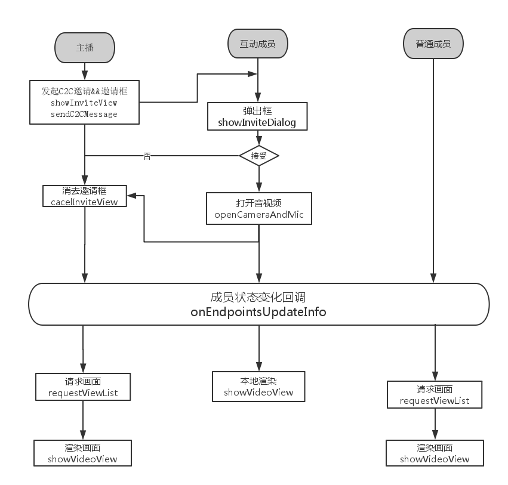
1. a)信令请求和应答是通过IMSDK的C2C消息。应答信令消息之后是打开或者关闭自己摄像头。
2. b)直播过程中成员音视频状态发送改变会通过onEndpointsUpdateInfo回调传递给所有成员。根据Id去请求对方画面，这种请求是AVSDK的接口不再是C2C消息。请求成功渲染画面。
3. c)成员状态变化回调onEndpointsUpdateInfo回调会包括自己，所以无论视频互动成员还是普通成员只需要根据回调里面的ID去请求画面即可同步，保持一致。

## 退出

退出分为主动退出和被动退出

（1）主动退出流程

 1发送群消息告知自己退出

 2 退出AV房间

 3 退出IM房间

（2）被动退出 （一般是房间已经解散情况下）

 1 退出AV房间

 2 退出IM房间

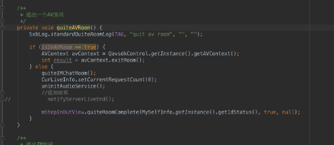
## 开发中注意的点

### 权限检查

我们知道，Android 6.0系统中定义了新的权限机制，为保证在Android 6.0的机器上正常运行，我需要对一些危险权限进行动态申请授权，这里可以参考随心播中的LoginActivity.java(读取手机信息，写存储卡等权限)及LiveActivity.java(打开摄像头、录音等权限)。

### IM互踢

随心播中的信令及消息基于IMSDK实现，当相同的帐号在其它终端登陆时，终端设置的状态回调会收到被踢消息(onForceOffline)，此时IM将变为离线状态(无法收发消息，无法连接邀请或收到邀请等)，所以随心播里做法是直接给出提示发送广播退出应用。为保证所有应用都能正常退出，随心播中的所有Activity都是继承于基类BaseActivity或BaseFragmentActivity，在基类中监听被退出广播，在收到广播时结束应用。

### 后台

   出于对用户隐私的尊重(避免用户将直播遗忘在后台造成信息泄露)，随心播在切到后台时，是会关闭摄像头及Mic的(包括主播和上麦观众)，同时会发送一条消息，告诉观众主播暂时离开，在切回前台时，恢复并同样发送消息通知。

   这一块的逻辑在LiveHelper的pause的resume方法中实现，开发者在二次开发时可按需调整(不建议去掉此处逻辑)。

   注：关闭摄像头及Mic会关闭上行流量，切到后台时还可以关闭所有下行请求，并在切回前台时恢复(这样可以关闭所有流量)。

### 电话、耳机中断

   在直播过程中收到来电时，如果接听来电，随心播会确发切到后台逻辑(参考上一节)，直播会临时中断，在电话结束后，可以正常恢复直播。

   在观看直播过程中插入耳机，声音会自动切换到耳机播放，耳机拔出后，会自动恢复扬声器播放。

### Log 位置

应用层Log /sdcard/tencent/sxblog/包名/

IMSDK和AVSDK  /sdcard/tencent/imsdklogs/包名/

## 性能优化

### IM消息显示

   热门直播房间成员能够轻易突破万人，IM消息并发量相当可观。如果简单地来一条消息即更新显示，很容易出现卡顿甚至ANR，所以随心播在收到消息时做了一个缓存。

   随心播在这里创建了一个缓冲链表mTmpChatList用来缓冲数据，当有新消息需要更新时，由notifyRefreshListView处理，流程如下:

  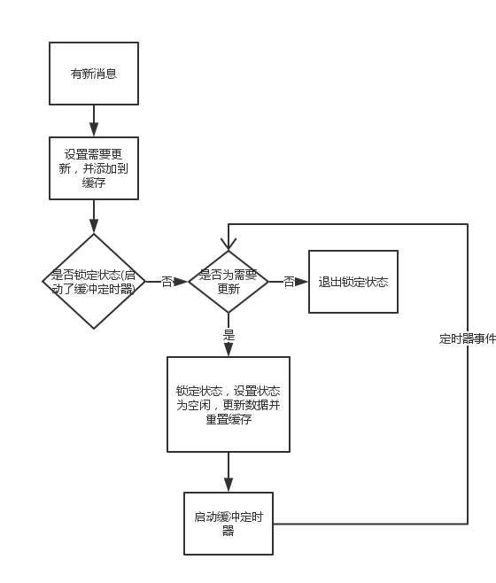
### 渐隐动画

   随心播聊天室的消息渐隐动画，作为一个个性化功能的示例，该功能可在设置菜单中开启(鉴于对性能的损耗，一般不推荐使用)。

   随心播的消息渐隐动画是基于android的属性动画实现。消息显示由一个ListView控件实现，该控件能够自动调整高度，保证完整显示7条消息(由ITEMCOUNT常量指定)。对于动态调整高度的ListView，getView回调的调用变得不再单纯，所以使用一个链表(mAnimatorInfoList)存储动画的状态，以便可以随时生成后续动画。

   这里做了一些优化避免性能的浪费，这里作了以下优化：

1. 1、限定播放8个item的属性动画(由MAXANIMATORCOUNT指定)
2. 2、在滚动时关闭所有属性动画
3. 3、计算ListView动态高度时不生成动画
4. 4、刷新时只播放可视范围内的动画(参考continueAllAnimator方法)
5. 5、只保存50条消息记录(由MAXITEMCOUNT指定)