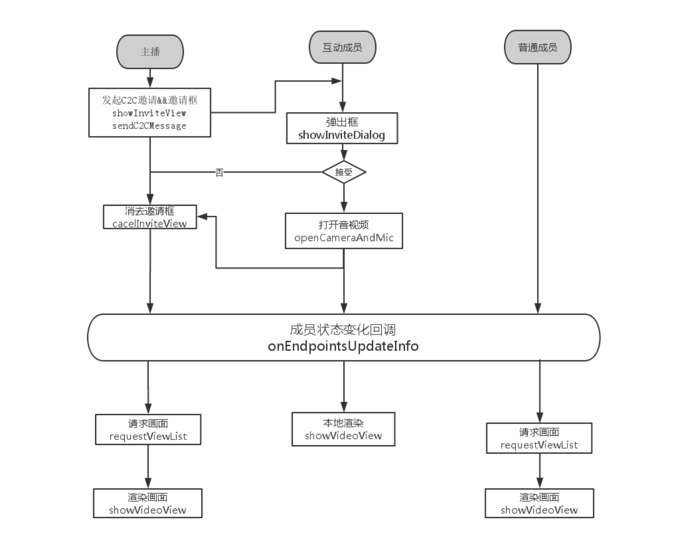

##互动上麦与消息

###1.发送消息

####普通文本消息
| 接口名|  接口描述  |
|---------|---------|
| **sendText** | 发送文本消息 通过消息体类型可以发群消息和C2C消息 |


| 参数类型| 说明 |
|---------|---------|
| ILVText | 文本消息类 可以指定消息类型（群消息或C2C消息）消息内容，消息接受者（群则是群ID，个人则是个人ID）|
| ILiveCallBack | 发送消息回调接口 |

* 发文本示例

```java          
            //发送消息
            ILVText iliveText = new ILVText("ss", "", ILVLiveConstants.GROUP_TYPE);
            iliveText.setText("" + textInput.getText());
            //发送消息
            ILVLiveManager.getInstance().sendText(iliveText, new ILiveCallBack() {
                @Override
                public void onSuccess(Object data) {
                    Toast.makeText(LiveActivity.this, "send succ!", Toast.LENGTH_SHORT).show();
                }

                @Override
                public void onError(String module, int errCode, String errMsg) {

                }

            });
```


####信令消息
| 接口名|  接口描述  |
|---------|---------|
| **sendCustomCmd** | 发送信令消息 通过消息体类型可以发群消息和C2C消息 |


| 参数类型| 说明 |
|---------|---------|
| ILVCustomCmd | 信令消息类 可以指定消息类型（群消息或C2C消息）消息内容，消息接受者（群则是群ID，个人则是个人ID），以及String类型参数|
| ILiveCallBack | 发送消息回调接口 |

* 上麦邀请示例

```java 
            //邀请上麦
            ILVCustomCmd cmd = new ILVCustomCmd();
            cmd.setCmd(ILVLiveConstants.ILVLIVE_CMD_INVITE);
            cmd.setType(ILVLiveConstants.C2C_TYPE);
            cmd.setDestid("" + memId.getText());
            cmd.setParam("");
            ILVLiveManager.getInstance().sendCustomCmd(cmd, new ILiveCallBack<TIMMessage>() {
                @Override
                public void onSuccess(TIMMessage data) {
                    Toast.makeText(LiveActivity.this, "invite send succ!", Toast.LENGTH_SHORT).show();
                }

                @Override
                public void onError(String module, int errCode, String errMsg) {

                }

            });            
```        

*  **特别注意 为了方便用户自定义信令 iLiveSDk保留了一个自定义区域**<br/>
```java    
    public static final int ILVLIVE_CMD_CUSTOM_LOW_LIMIT = 0x800;          //自定义消息段下限
    public static final int ILVLIVE_CMD_CUSTOM_UP_LIMIT = 0x900;          //自定义消息段上线
```


         
###2.解析消息

* 解析信令上麦

```java
        ILVLiveConfig liveConfig = new ILVLiveConfig();

        liveConfig.setLiveMsgListener(new ILVLiveConfig.ILVLiveMsgListener() {
            @Override
            public void onNewTextMsg(String text, String id) {
                Toast.makeText(LiveActivity.this, "onNewTextMsg : " + text, Toast.LENGTH_SHORT).show();
            }

            @Override
            public void onNewCmdMsg(int cmd, String param, String id) {
                switch (cmd) {
                    case ILVLiveConstants.ILVLIVE_CMD_INVITE:
                        Toast.makeText(LiveActivity.this, "onNewCmdMsg : received a invitation! ", Toast.LENGTH_SHORT).show();
                        ILiveLog.d(TAG, "ILVB-LiveApp|received ");
                        ILVLiveManager.getInstance().upToVideoMember(ILVLiveConstants.VIDEO_MEMBER_AUTH, ILVLiveConstants.VIDEO_MEMBER_ROLE, new ILiveCallBack() {
                            @Override
                            public void onSuccess(Object data) {

                            }

                            @Override
                            public void onError(String module, int errCode, String errMsg) {

                            }
                        });
                        break;
                    case  ILVLiveConstants.ILVLIVE_CMD_INVITE_CANCEL:

                        break;
                    case ILVLiveConstants.ILVLIVE_CMD_INVITE_CLOSE:
                        ILVLiveManager.getInstance().downToNorMember(ILVLiveConstants.NORMAL_MEMBER_AUTH, ILVLiveConstants.NORMAL_MEMBER_ROLE, new ILiveCallBack() {
                            @Override
                            public void onSuccess(Object data) {

                            }

                            @Override
                            public void onError(String module, int errCode, String errMsg) {

                            }
                        });
                        break;
                    case ILVLiveConstants.ILVLIVE_CMD_INTERACT_AGREE:
                        break;
                    case  ILVLiveConstants.ILVLIVE_CMD_INTERACT_REJECT:
                        break;
                }

            }

            @Override
            public void onNewCustomMsg(int cmd, String param, String id) {
                Toast.makeText(LiveActivity.this, "cmd "+ cmd, Toast.LENGTH_SHORT).show();

            }
        });
```                               
            
            
  
###2.上麦互动
* 上麦互动流程示意图    
          
