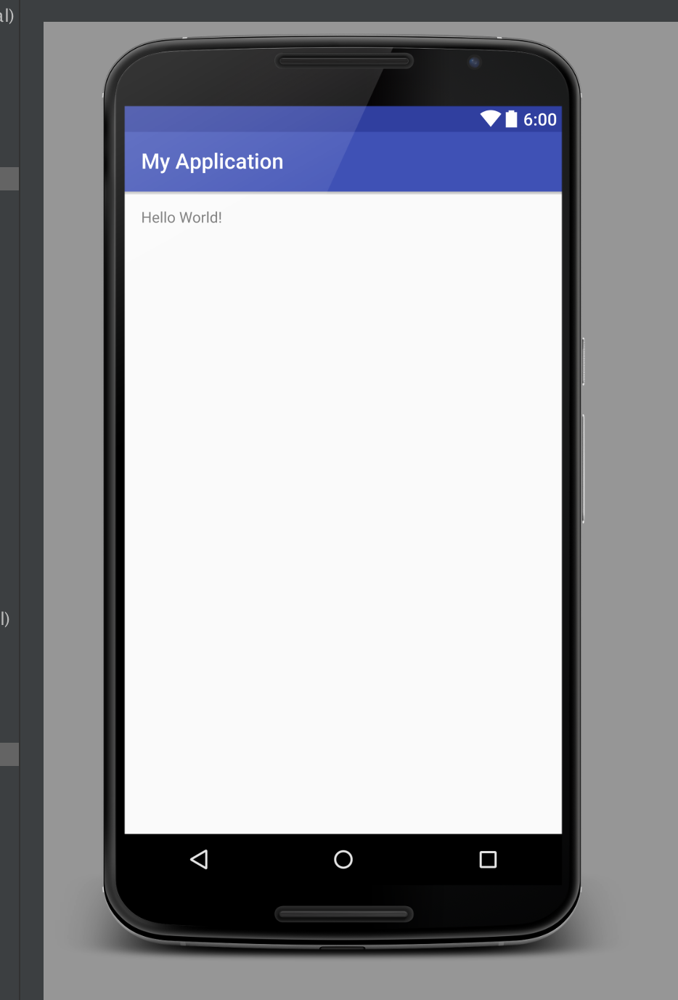
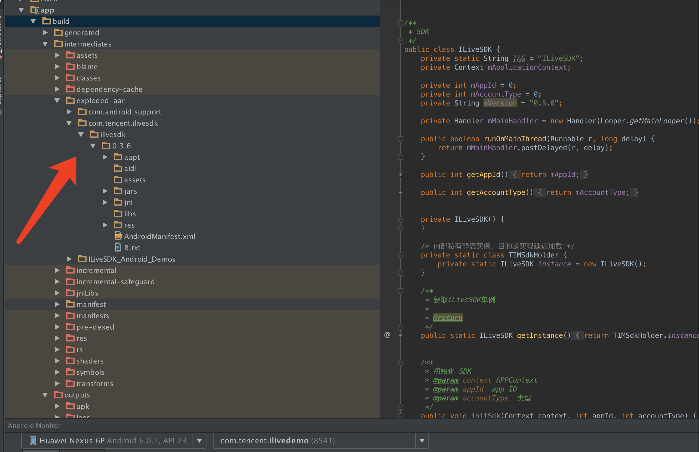
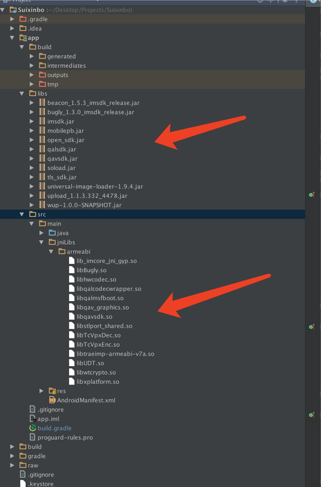

#准备

鉴于Google已经官方声明不再支持eclipse开发，强烈建议你用Android Studio开发 

##搭建编译环境
1. [下载配置JDK](http://www.oracle.com/index.html)           
	
	
2. [下载 Android Studio](https://developer.android.com/studio/index.html)

3. 配置环境
	* [配置JDK环境变量参考](http://jingyan.baidu.com/article/e2284b2b5967e7e2e7118d74.html)
	* [配置Android Studio参考](http://stormzhang.com/devtools/2014/11/25/android-studio-tutorial1/)
	* Google服务在国内网络不稳定，推荐用VPN访问（推荐PureVPN）
    
4. 当环境配置完毕，可以建一个工程测试下,当看到HelloWorld打印，表示环境搭建完成           

#1.下载SDK
###aar方式集成 
	如果你使用的Android Studio开发，那么导入iliveSDK非常简单。只需一行代码就可以搞定了 

	compile 'com.tencent.ilivesdk:ilivesdk:X.X.X'  
	
	(X.X.X 替换成对应版本号 比如0.3.7)

###传统库类方式集成
* 在腾讯云官网[下载音视频库类](http://www.oracle.com/index.html)

##库类介绍
从官网上下载的SDK主要包含以下文件夹：

| 文件夹 | 说明 |
|---------|---------|
| docs | 里面放了一些开发文档 包括API更新列表 |
| libs | SDK是以jar和so文件的形式提供给APP使用的，方便普通方式集成和eclipse方式开发 |
| asserts | 音视频核心库类，目前只支持armeabi架构 |

####库类清单
| 序号  | 名称 | 所在文件夹 | 说明 |
|---------|---------|---------|---------|
| 1 | qavsdk.jar | libs\jar | 音视频SDK。|
| 2 | libhwcodec.so | libs\armeabi | 编解码。 |
| 3 | libqav_graphics.so | libs\armeabi | 音视频图形界面。|
| 4 | libqavsdk.so | libs\armeabi |  音视频SDK。|
| 5 | libstlport_shared.so | libs\armeabi | 音视频基础库。 |
| 6 | libTcVpxDec.so | libs\armeabi | 视频组件。|
| 7 | libTcVpxEnc.so | libs\armeabi | 视频组件。 |
| 8 | libtraeimp-armeabi-v7a.so | libs\armeabi | 音频组件。|
| 9 | libxplatform.so | libs\armeabi | 音视频基础库。| 
| 10 | beacon_1.5.3_imsdk_release.jar | libs\jar | 音视频SDK。|
| 11| bugly_1.2.8_imsdk_release.jar | libs\jar | 即时聊天crash上报。
| 12 | imsdk.jar | libs\jar | 即时聊天的SDK。|
| 13 | mobilepb.jar | libs\jar | protouf编解码相关。|
| 14| qalsdk.jar | libs\jar | imsdk网络层。|
| 15 | tls_sdk.jar | libs\jar | 登录相关。|
| 16 | wup-1.0.0-SNAPSHOT.jar | libs\jar | imSdk相关依赖包。|
| 17 | lib_imcore_jni_gyp.so | libs\armeabi |  即时聊天。|
| 18 | libBugly.so | libs\armeabi | crash上报。|
| 19 | libqalcodecwrapper.so | libs\armeabi | qalsdk相关。|
| 20 | libqalmsfboot.so | libs\armeabi | qalsdk相关。|
| 21 | libwtcrypto.so | libs\armeabi | 登录依赖。|
**特别注意：**APP开发者在更新替换SDK的时候，务必要保证以上所有文件的完整性。如果仅局部地替换个别文件，很可能会引入异常。

[了解更多IMSDK的信息](http://www.qcloud.com/product/im.html)

#2导入项目
* **aar方式集成**,同步完成之后可以在build文件夹中找到ilivesdk文件夹。    
  
	
	
		
* **传统库类方式集成**，则需要把so文件和jar包文件分别放到对应jnilibs和libs里面。        
   
     
   
 **特别注意：**目前音视频相关库类只支持armeabi架构。[关于多架构的问题总结](https://github.com/zhaoyang21cn/Android_Suixinbo/issues/6)
   
 
* [eclipse开发集成](https://github.com/zhaoyang21cn/ILiveSDK_Android_Demos/blob/master/doc/ILiveSDK/eclipse_readme.md) (不推荐)

 
    	
	

   
    