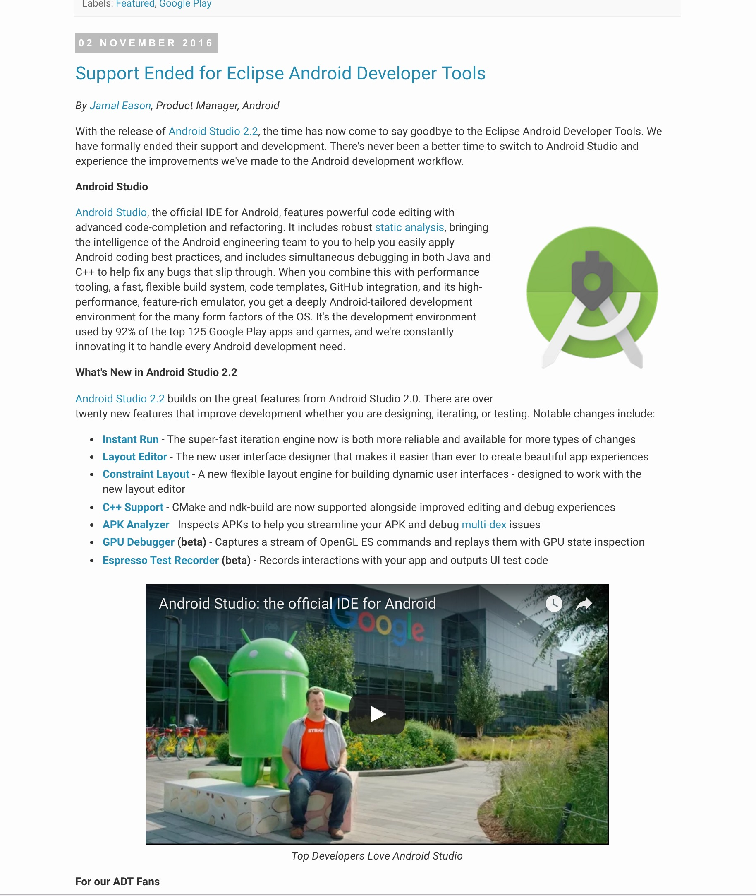
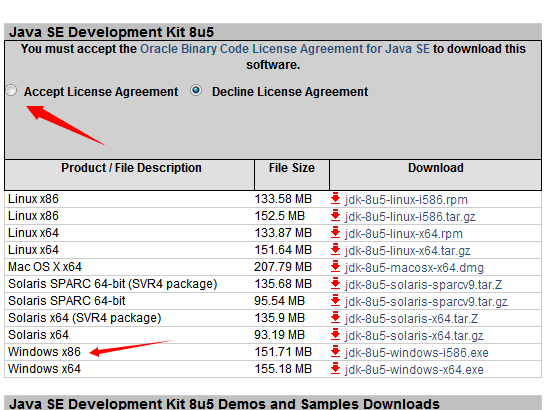
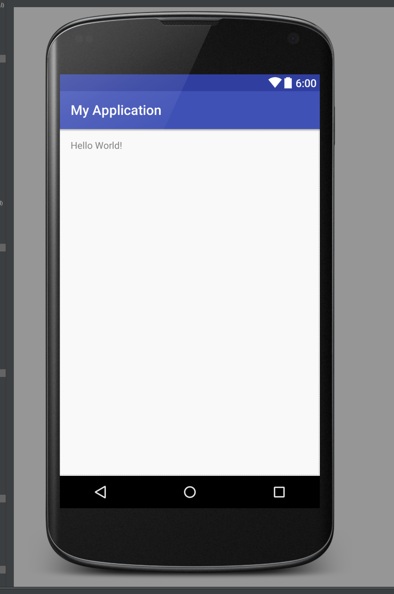

#准备

鉴于Google已经官方声明不再支持eclipse开发，强烈建议你用Android Studio开发 

##搭建编译环境
1. [下载配置JDK](http://www.oracle.com/index.html)           
	
	
2. [下载 Android Studio](https://developer.android.com/studio/index.html)

3. 配置环境
	* [配置JDK环境变量参考](http://jingyan.baidu.com/article/e2284b2b5967e7e2e7118d74.html)
	* [配置Android Studio参考](http://stormzhang.com/devtools/2014/11/25/android-studio-tutorial1/)
	* Google服务在国内网络不稳定，推荐用VPN访问（推荐PureVPN）
    
4. 当环境配置完毕，可以建一个工程测试下,当看到HelloWorld打印，表示环境搭建完成
	

   
    