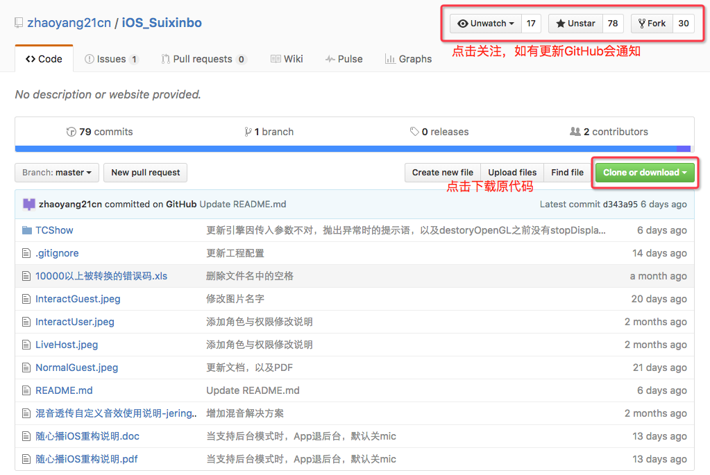
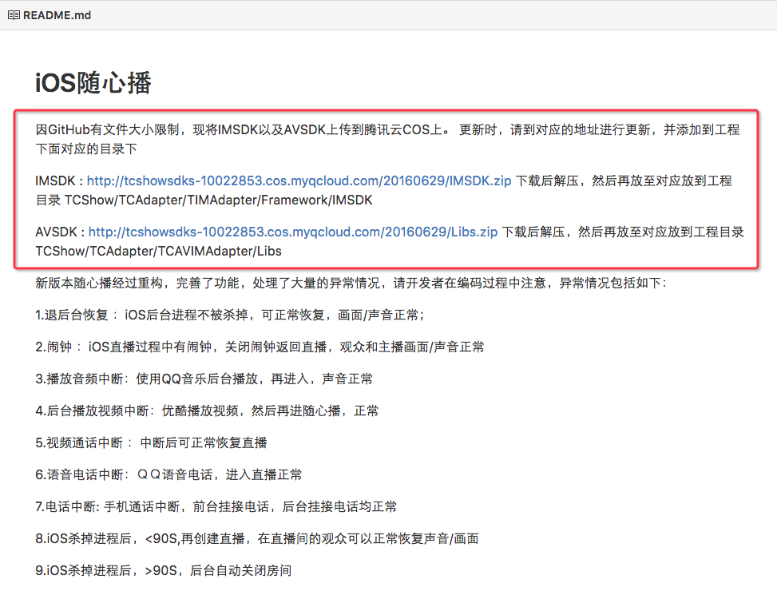
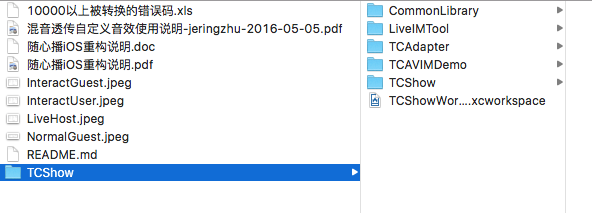
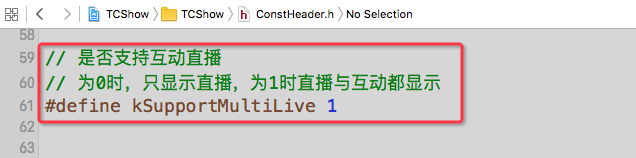
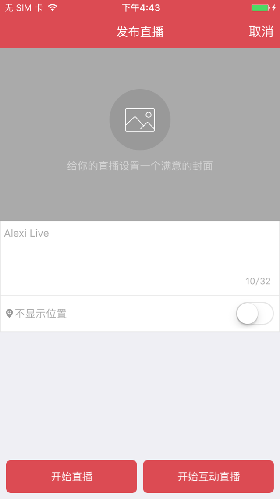
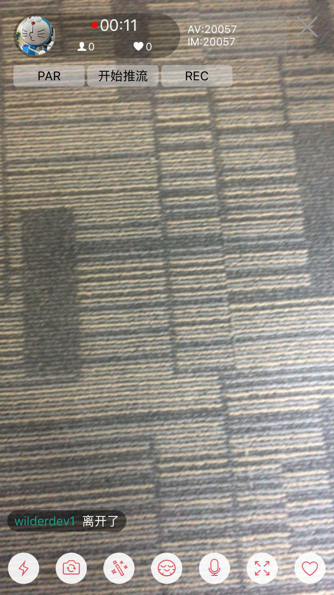
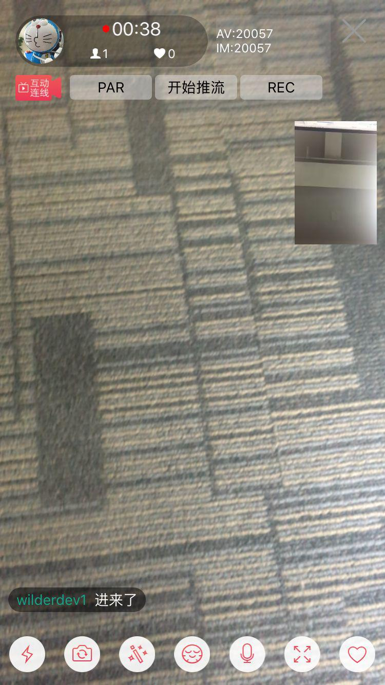

# 随心播运行指南

## 随心播功能说明 
随心播是基于腾讯云[**云通信（IMSDK)**](https://www.qcloud.com/product/im.html)与[**互动直播（AVSDK）**](https://www.qcloud.com/product/ilvb.html)，用于对外部用户演示与集成的产品，并上传至[**AppStore**](https://itunes.apple.com/cn/app/sui-xin-bo/id1037944078?mt=8)（用户亦可在AppStore搜索随心播进行下载）。其包含常用直播/互动直播两个场景（AppStore版本对外只显示了互动直播场景）。其演示了IMSDK与AVSDK结合进行直播、互动直播时如何进行画面请求与渲染，聊天消息，信令控制，推流录制等。

## 随心播下载与运行 
因业务需要，将随心播的代码上传至[**GitHub**](https://github.com/zhaoyang21cn/iOS_Suixinbo)，GitHub定期会有更新与维护，其使用的SDK版本较腾讯云上的版本会较新（原[**腾讯云互动直播**](https://www.qcloud.com/product/ilvb.html)上只存放正式版本，GitHub使用的IMSDK与AVSDK可能会是最新的稳定版本）。

用户打开[**GitHub**](https://github.com/zhaoyang21cn/iOS_Suixinbo)后，可以**Star**随心播，这样腾讯更新代码时，GitHub会通知到。同时注意阅读ReadMe。用户也可以在GitHub上给随心播提issue，我们会定期查看并回复。

用户点击右上角Clone or
download下载代码到本地后，注意阅读ReadMe，因GitHub有文件大小限制，我们将AVSDK+IMSDK存储在腾讯云COS服务上，用户还需要去对应下载SDK文件，并按照说明解压到对应的目录。

下载并解压代码与并下载配置好SDK后，如下图：

| 文件名 | 说明 |
| ------ | ------ |
| 10000以上被转换的错误码   | 出现10000以上错误时，先将日志开启，再重现，然后搜索日志中ERROR. SERVER\_ERROR. server ret\_code 再对比码表找到对应的错误码 |
| 随心播iOS重构说明           | 随心播代码导读 |
| ReadMe + 4张JPEG          | ReadMe说明，以及Spear推荐配置说明 | 
| TCShow                    | 源代码目录 |
| TCShow/CommonLibrary      | 代码中的工具包，以及UI框架 |
| TCShow/TCAdapter          | 重构以及复用的核心部分 |
| TCShow/LiveIMTool         | IM工具，用于直播间内消息压测 |
| TCShow/TCAVIMDemo         | 集成演示Demo，以及一些不常用的，不同场景，不便于在随心播中演示的功能，会在此处进行演示 |
| TCShow/TCShow             | 随心播工程目录 |

打开iOS\_Suixinbo/TCShow目录下的TCShowWorkSpace.xcworkspace，打开后选择好对应的TCShow

## 随心播运行注意事项 
户在真机上运行时，在进入到直播发布页可以看到的开始直播与开始互动直播两个按钮（见下图一），分别点击进入后对应直播界面（图二）与互动直播界面（图三），虽然在随心播里面直播与互动直播可以互看，而且界面也非常类似，但是互动直播内部逻辑较直播要复杂很多，如果用户只是做直播，为方便用户进行代码阅读，可将代码的宏kSupportMultiLive改为0，以便理解代码逻辑。

