# 导入框架

## <a name="CommonArchitecture">架构设计及说明</a>

通用的App框架是基于系统（OS System Service），自底向上分作三层：

| 模块层 | 作用 |
| -------------- | ------ |
| **App Core Service** | App核心服务层，对外提供核心功能（如IMSDK，AVSDK）等 |
| **App Adapter** | 业务逻辑适配层，App根据自身的业务不同，将App Core Service提供的核心功能进行封装，以方便外部使用 |
| **App UI** | 各功能模块对就看整屏界面，主要负责界面内部Custom UI的布局与调度 | 
| **Custom UI** | 自定义UI层，主要作用是把界面上的大模块拆分到小的自定义的小模块（Custom View）中进行实现，实际开发中隶属于AppUI，可在各App UI模块中进行复用的部分 |
| **Common Library** | 公用代码库，主要基础工具类，第三方代码等，用作代码搜集以及后期复用 |

通用App框架各分层通信模型如下：

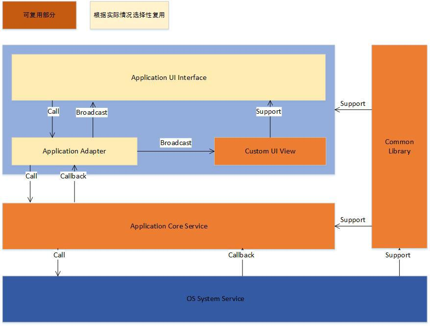

各箭头含义: 
| 箭头 | 含义 |
| ------ | ------ |
| Call | 调用 |
| CallBack | 回调 |
| Broadcast | 广播 | 
| Support | 支撑/支持 |

## <a name="TCAdapterArchitecture">TCAdapter如何复用框架</a>

为了方便用户进行集成，我们设计TCAdapter，将AVSDK与IMSDK进行再封装，降低用户使用AVSDK+IMSDK来开发直播场景等业务类App门槛：

-   **用户可以通过集成TCAdapter来扩展自身业务逻辑，集成者更多地关注自身的业务逻辑上的处理**；

-   **TCAdapter中处理了大量直播中常见的问题，这些问题处理让用户自行实现的话可能会比较麻烦**；

-   **TCAdapter经过测试，稳定性上有一定的保证**；

TCAdapter对应通用框架即为下图

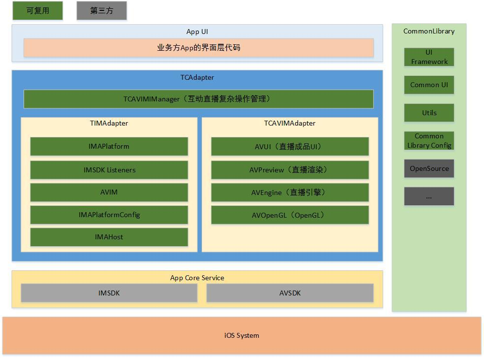

熟悉过TCAdapter中的代码后，你会发现其对应基本模型如下图，其每个模块都有默认的内容，并且也都支持定制扩展。TCAdapter内部负责管理各模块之间的协作，实际开发中，用户只要逐一完成一个个模块即可。

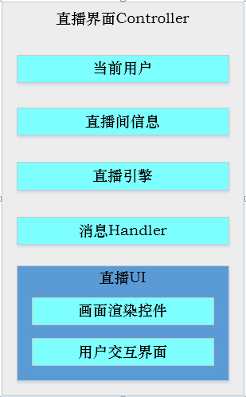

## <a name="TCShowArchitecture">随心播如何扩展框架</a>
随心播集成TCAdapter之后对应层次即为下图，其他业务集成后对应的层次图也如下

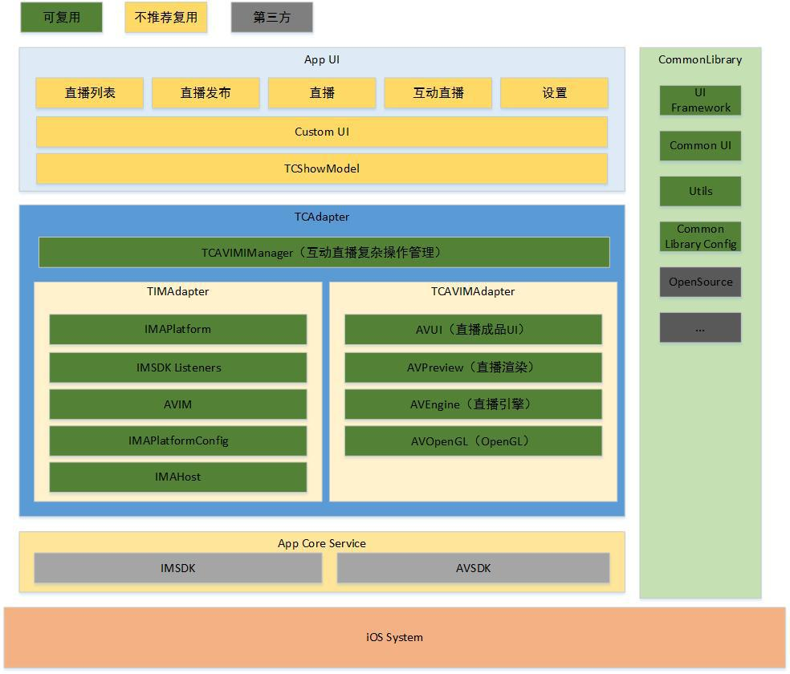

其他第三方在集成TCAdapter时，同样也需要可以复用的TCAdapter（里面已将App
Core Service的SDK添加到其中），CommonLibrary，然后再实现其App
UI部分（主要指跟直播、互动直播相关的模块）。

# <a name="ArchitectureIntegrate">框架集成</a>
开始集成前，请务必下载<a href="https://github.com/zhaoyang21cn/iOS_Suixinbo">*GitHub*</a>上最新的代码,以创建**TCAVIMDemo**为例，过程中会介绍已有项目如何集成，每进行一步结束时，都**Build**一下，以确保每步都正常。

## <a name="ConfigNewProject">配置新的工程</a>
若当前为新工程TCAVIMDemo，并删除默认生成的内容，设置**Enable BitCode**
为**NO**，设置**Other Linker Flags** 为 **-ObjC（注意大小写）**，增加PCH文件 
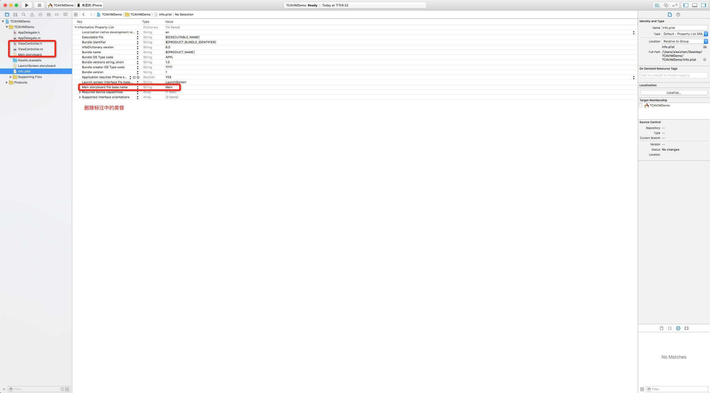
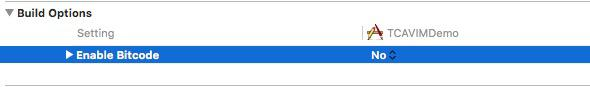
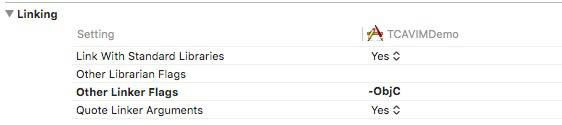
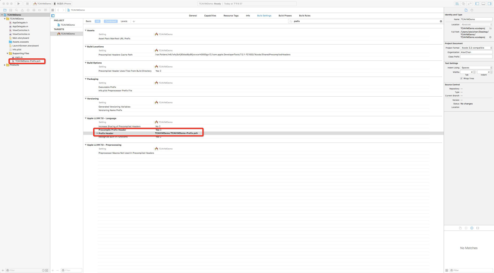
 

同是配置C++相关的配置如下:**如果不配置，会导致调试时在Console下po时，拿不到正确的值** 
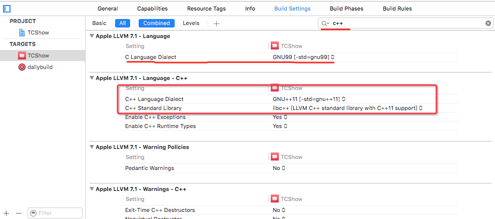

## <a name="ImportLibrary">导入CommonLibrary</a>
导入CommonLibrary，添加到PCH，并添加Compiler Flags
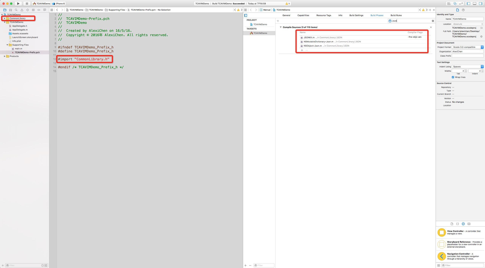

此时用户若只想用CommonLibrary进行App开发，还需要配置AppDelegate。

修改前 
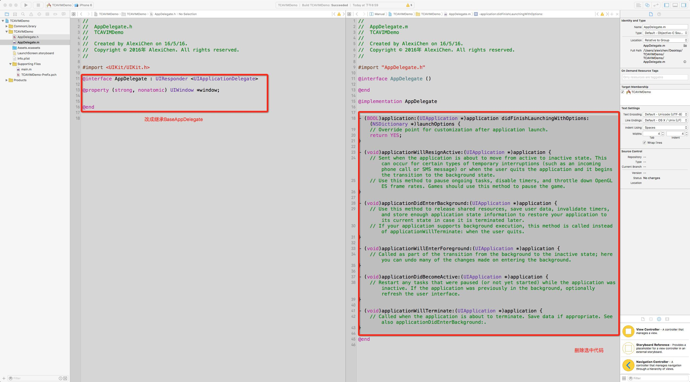

修改后 
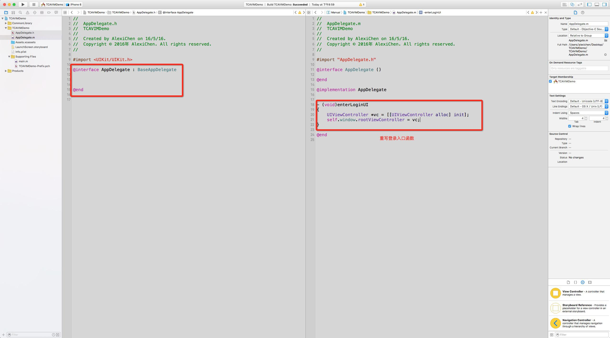

## <a name="ImportTCAdapter">导入TCAdapter</a>
导入TCAdapter，添加到PCH，添加依赖库（**因可能文档没有及时更新，请以TCShow中SystemLibrary为准**）: 
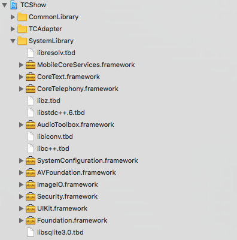

添加CompilerFlags，请注意阅读红字部分 
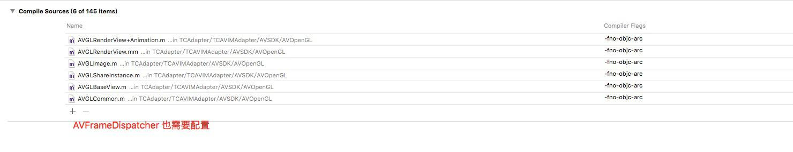

若用户参考的是Demo中目录结构（CommonLibrary与TCAdapter不在当前工程目录下），注意配置以下Search
Path，以确保能访问到正确的目录（下图实际配置与App相关只作参考） 
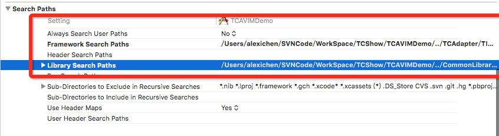

完成以上步骤，即可编译成功，用户在保证编译成功的前提下，再继续后面的步骤。

**1.8.1之后的版本请注意添加 libresolv.tbd
(用于支持ipv6)，另外XCode7.3(在写该文档时，已升级到7.3，低版本未试过)
的用户编译后可能会报下面的问题，不要惊慌，其不影响在真机上调试，至于为什么报错（网上了解到的是跟C++有关），暂未找到具体解决办法，后续如有找到，再更新该处**
 
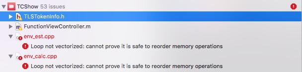

在完成以上步骤时，再进行<a href="#ConfigAppParam">*配置AppID*</a>即已完成TCAdapter框架的集成了，后续的<a href="#Architecture_ConfigLogin">第四步</a>，<a href="#Architecture_AddMain">第五步</a>只是介绍如何配置与简单的使用。

## <a name="Architecture_ConfigLogin">配置托管模式登录功能</a>
配置AppDelegate ，使用支持登录功能 
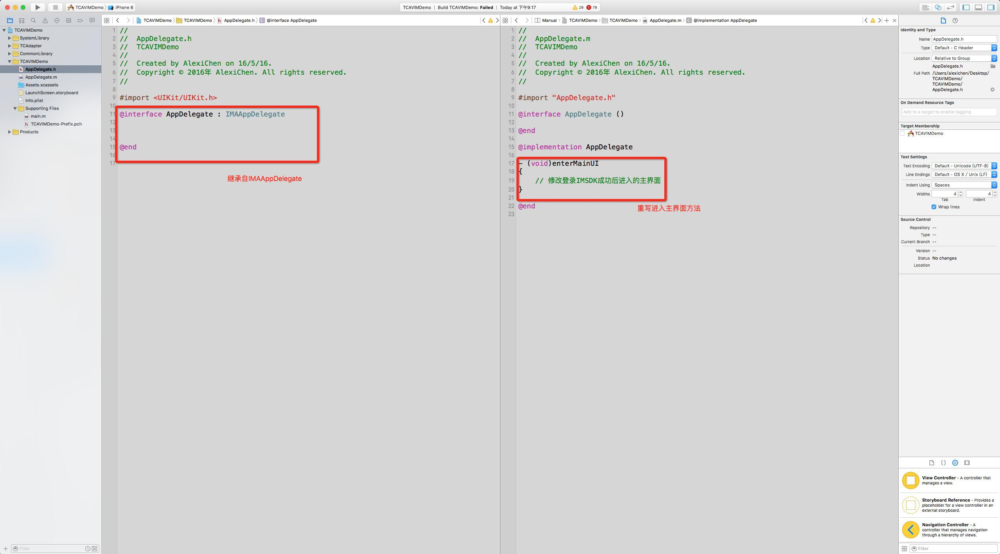

若不是新建的工程，而是在现有代码上集成，此处注意：

-   用户根据情况而定，看是否需要继承IMAAppDelegate;

-   若不能直接继承IMAAppDelegate，用户需要参考IMAAppDelegate，以及BaseAppDelegate代码，将相关逻辑移植到现有的代码中。

## <a name="Architecture_AddMain">添加主界面后的效果</a>
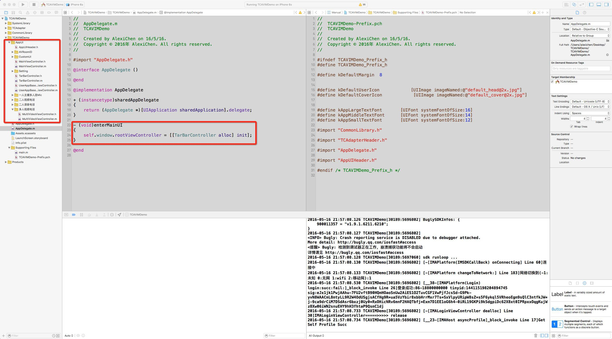

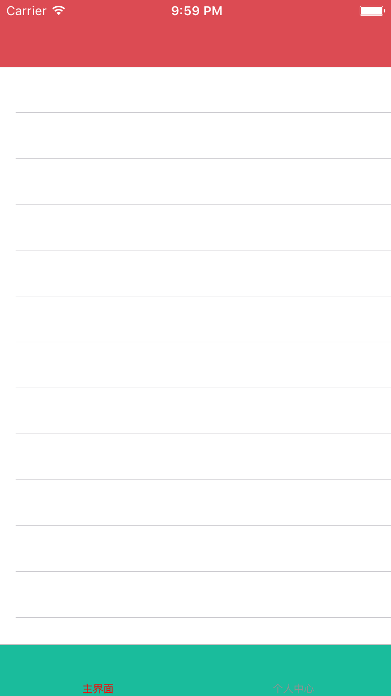

界面中一些基本的样式，可能通通修改BaseAppDelegate中的CommonLibraryConfig.h中的配置进行修改，如果不符合要求，可修改原代码（后期合并时注意）

另外用户如果想重写登录界面，可重写enterLoginUI方法即跳转到自己的登录界面，注意自已界面内与IMALoginViewController内部登录逻辑一致，确保IMSDK能正确登录。

**另外请注意**：若用户app使用了国际化，请将TCAdapter/TIMAdapter/Localizable.strings文件与自己app的国际化字符串文件进行合并

## <a name="ConfigAppParam">配置App参数</a>
修改自己App申请的AppID以及AccountType
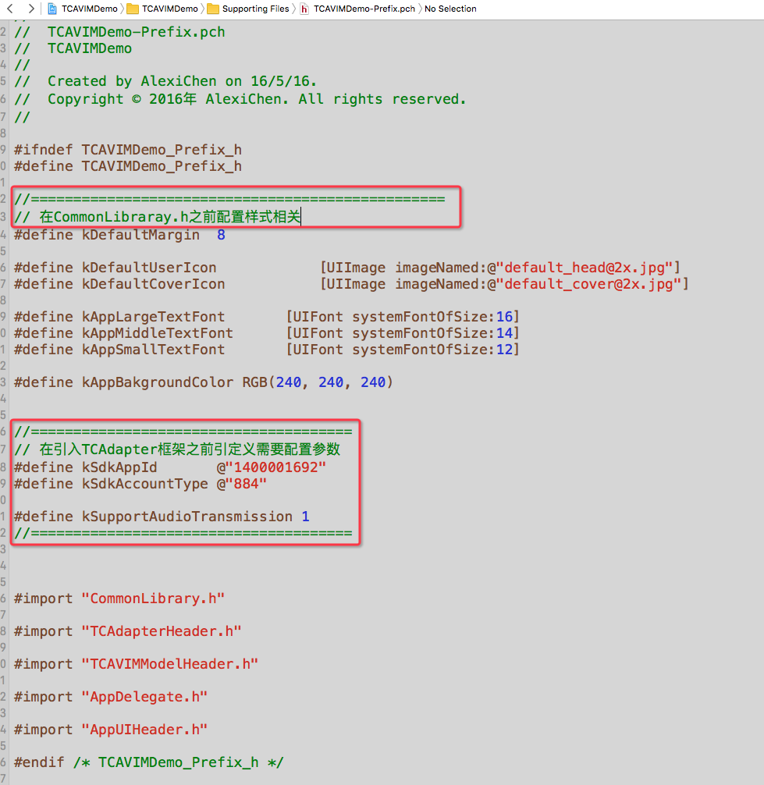

配置完以上步骤即可使用TCAdapter进行开发了，集成示例TCAVIMDemo中，使用其编写了几个简单的场景，详见代码。
