# <a name="DevelopGuide">开发指南</a>

**业务方在集成TCAdapter进行开发时，最好不要对框架内的代码作修改**，原因如下：

-   后期Demo有更新，TCAdapter有可能会有修改，这样可避免因Demo修改了，影响用户App的使用，另外当demo修改了，用户可集成只需要关注其重写的方法是否有修改，这样替换时工作量较小；

-   可通过继承来扩展自身逻辑，尽量重写Protected类别中的方法，如果重写类中的方法，注意保证与原类的逻辑一致；

下面结合随心播，重点介绍如何一步一步开发自己的直播/互动直播App，以及如何快速接入直播。

# <a name="DevelopPrepare">准备工作</a>

1. 在进行开发之前，需要申请腾讯云帐号，并在腾讯云上创建应用接入，拿到对应的AppID以及AccountType（腾讯云审核需要一段时间，期间可以用随心播的AppID以及AccountType进行测试，后期可再替换）；如果用户想在随心播上用自己的AppID先体验一下，那么可以修改随心播的配置成自己的AppID与AcoountType：修改后同时要把kIsTCShowSupportIMCustom改为0。修改之后，如果还不成功，请查下你的AppID是否对应为独立模式。 
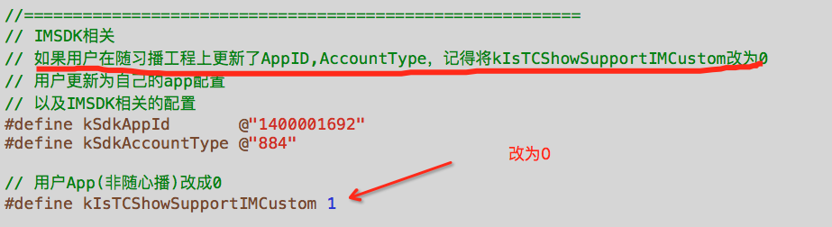

2. 在进行开发自业务前，先使用随心播，查看其直播/互动直播场景逻辑是否符合自身的需要（这也是<a href="2.架构集成.md?#TCShowArchitecture">*随心播框架*</a>中不推荐复用的原因之一），如果对比发现不同或有特殊需求，最好先在支持群内反馈是否支持，避免后期出现问题；

3. 对于在已有App上集成时，用户需要根据具体情况下配置AppDelegate。如果直接从BaseAppDelegate中有可能会影响已有功能（主要是样式相关的内容），那么可以修改下面的配置（将kIsIMAppFromBase改为0），实现快速集成。 
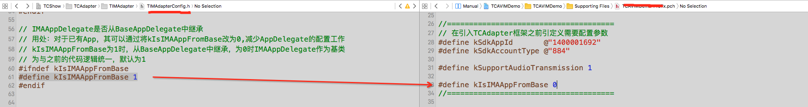

4. 下图为随心播中kIsIMAppFromBase为0时对应的修改（用户可自行修改此值以查看具体效果）。 
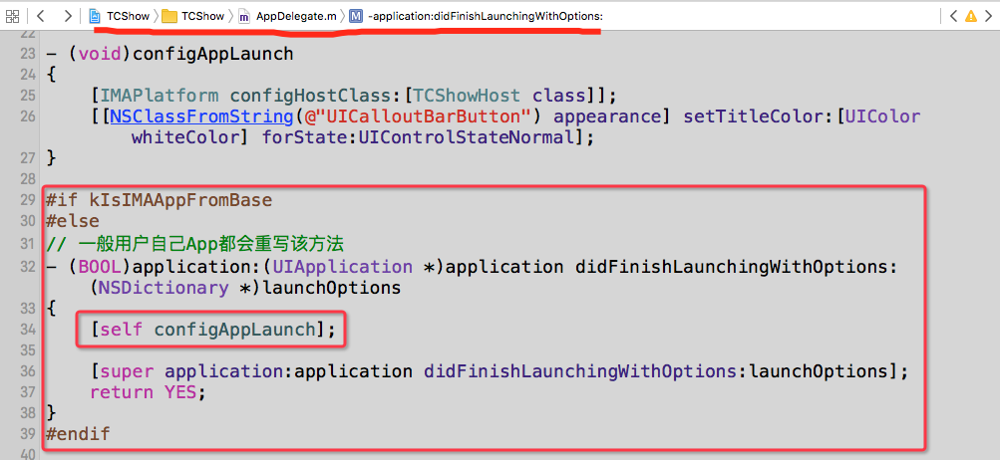

5. 提前说明一下：App内部要有用户协议声明以及举报功能，在开发前请检查App设计是否存在这样的功能：下图为老版本上AppStore被拒邮件： 
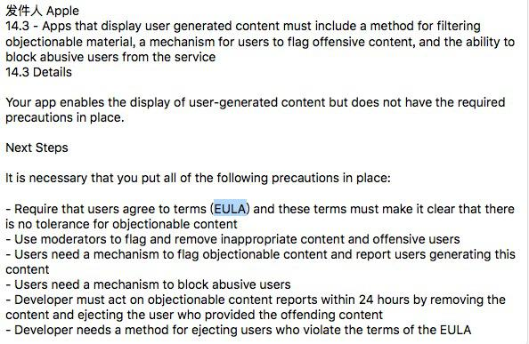 
**上传AppStore时，注意说明测试步骤，记得附带演示视频：新集成的App上线有可能直播列表页是空的，会导致审核人员无法正确使用你的App的功能。**

# <a name="DevelopLogin">账号登录</a>

腾讯云帐号登录体系分为两类：<a href="https://www.qcloud.com/doc/product/268/3330">*托管模式*</a>，<a href="https://www.qcloud.com/doc/product/268/3329">*独立模式*</a>。
二者区别： 
**托管模式**：托管模式是指，由TLS（Tencent Login
Service）为开发者提供APP帐号的密码注册、存储和密码验证，以及第三方openid和token的托管验证服务。帐号验证成功后，派发私钥加密生成的签名到客户端，APP业务服务器可以通过下载的公钥解密签名进行验证。 

**独立模式**：用户注册和身份验证由开发者负责，开发者和腾讯之间通过签名验证建立信任关系。开发者在申请接入时，可以直接下载公私钥用于开发，或者按照要求生成公私钥，将公钥提交腾讯服务器，而后用私钥加密指定数据生成签名交由腾讯服务器验证合法性。

## <a name="DevelopTCShowLogin">随心播中的帐号登录</a>

随心播为突出后面与直播、互动直播相关的内容，将登录功能简单地实现，使用托管方式进行登录。使用的界面（如下图）也是TLSUI.framework中所提供的，TCAdapter中的IMALoginViewController中处理的是TLSSDK的回调，主要实现自动登录，以及登录前IMSDK相关的配置工作，具体如何使用可阅读IMALoginViewController中的代码。用户可在前期集成时使用其快速进入到核心的直播/互动直播，去看效果，后期可以再替换自己的登录界面逻辑。 
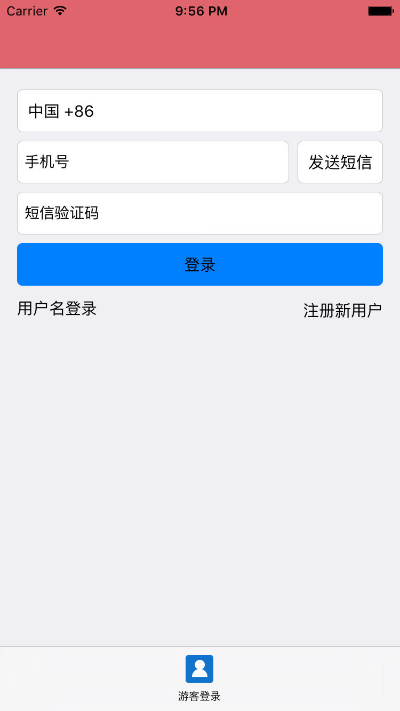
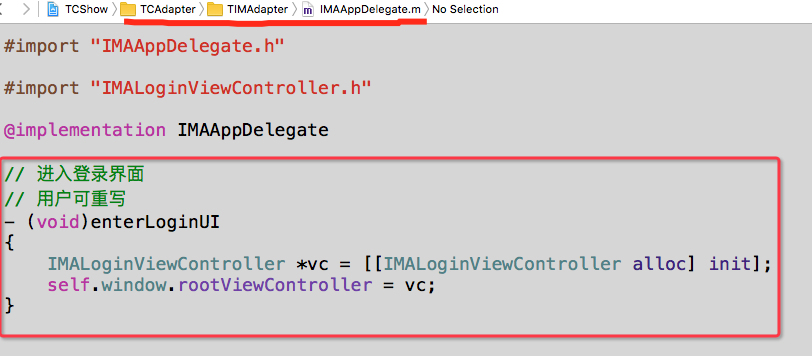

### 常见问题

1. <a name="DevelopCustomLiginUI"> 如何自定义登录界面？已有登录界面，如何支持？</a> 
用户在自己的AppDelegate中重写enterLoginUI，在具体实现中调用自己的登录界面即可，其用户自已登录界面的逻辑可参考IMALoginViewController中的实现。使用时，用户根据具体情况手动调用enterLoginUI方法即可。TCAdapter内部主要会调用enterLoginUI进行登录相关的处理。

# <a name="DevelopInitSDK">初始化SDK</a>

**SDK初始化工作主要是指IMSDK初始化与登录，AVSDK中要startContext。
目前TCAdapter中已封装此块的逻辑，用户只需要了解此节中的步骤即可，如果需要定制，可进入到对应处进行重写。**

## <a name="DevelopInitIMSDK">IMSDK初始化</a>

TIMAdapter下是将IMSDK进行了封装，初始化IMSDK的工作主要在IMAPlatform中，与初始化IMSDK相关的接口已封装下成面的三步，其调用顺序需要按照下面几步进行： 

1. <a name="DevelopInitIMSDK_ConfigIMAPlatform">配置IMAPlatform</a>
	配置主要分两个：**configIMSDK**，**configHostClass**； 
	**configIMSDK**：目前IMAPlatform只配置常用的与直播，互动直播相关的IMSDK项，以及SDK回调处理，用户如有其他逻辑可自行添加配置; 
	**configHostClass**：配置当前用户类型，参数必须为IMAHost子类，可选配置。（若配置时，具体可参考随心播中的TCShowHost） 
	
	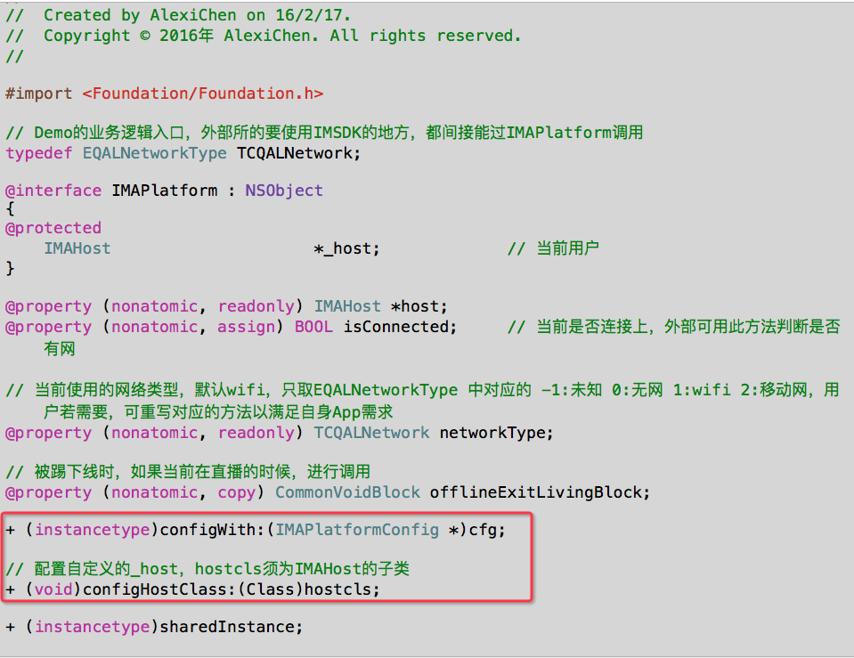
	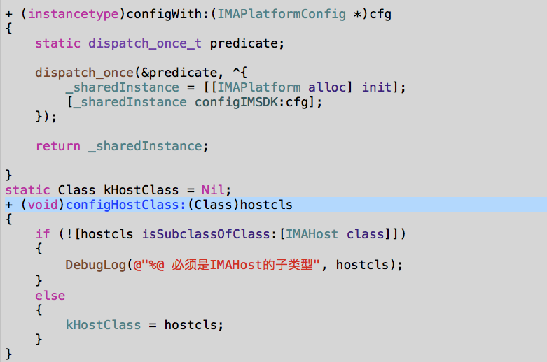
	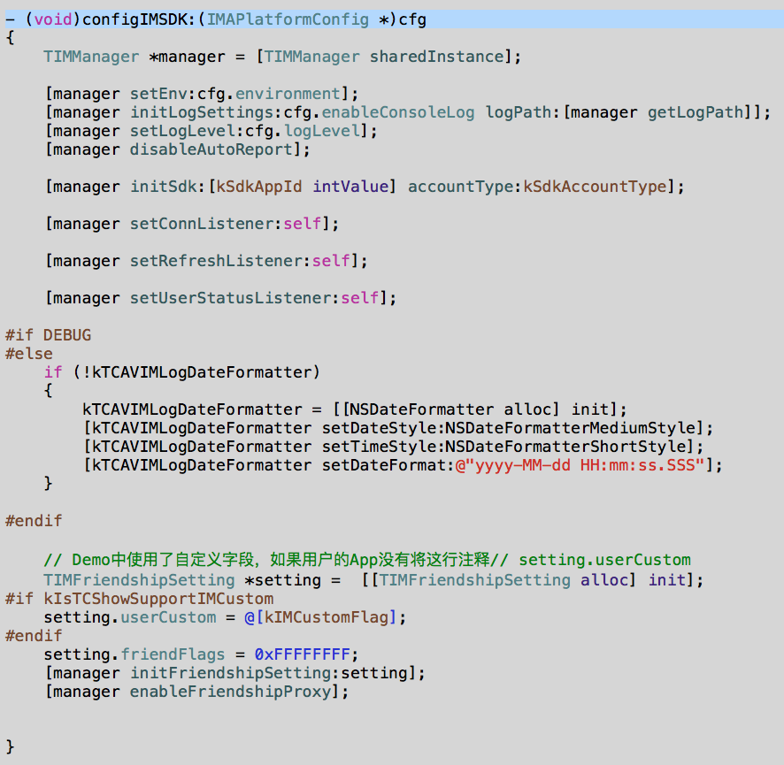
	 相关的IMSDK回调可参考**IMAPlatform+IMSDKCallBack**，其主要处理了跟用户登录相关的回调，关系链与群助手回调作空实现（内部未用到这部分的功能）。

2. <a name="DevelopInitIMSDKLogin">登录</a> 
	配置完IMAPlatform后，即可调用其封装（主要处理被踢下线逻辑，以及下次自动登录设置）过的登录接口进行登录。 
	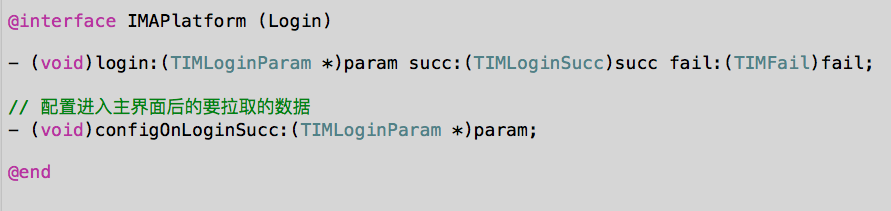

3. <a name="DevelopInitIMSDK_Step3">登录成功后配置</a> 
	登录成功后，需要调用上图中的configOnLoginSucc进行登录成功后的配置。 
	登录后的配置主要有三小步：创建Host，配置AVSDK上下文，销毁历史房间，三步是并行的不用等回调；
	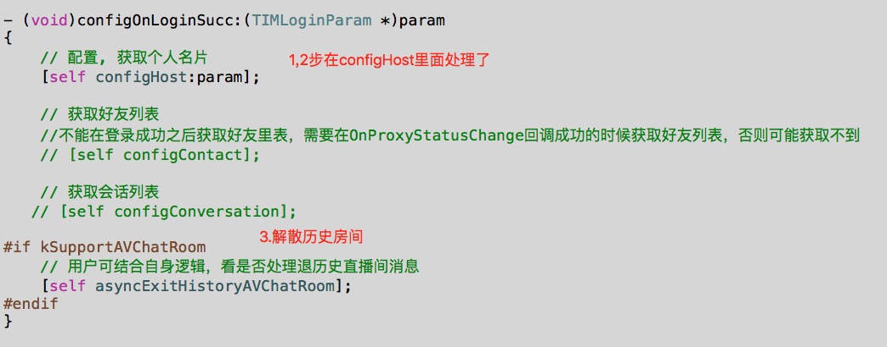
	

## <a name="DevelopInitAVSDK">AVSDK上下文初始化</a>

TCAdapter中将QAVContext封装成单例TCAVSharedContext。理论上AVSDK上下文在登录IMSDK之后（未登出之前）调用均可，TCAdapter中将其放到登录IMSDK之后立即进行上行文创建并startContext，登出时，然后stopContext并销毁。其具体调用处可参考<a href="#DevelopInitIMSDK_Step3">*IMSDK初始化中的第三步*</a> 
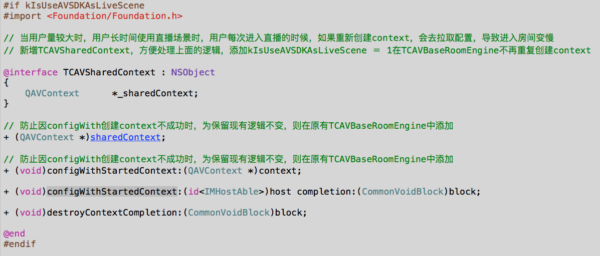

# <a name="DevelopSpearConfig">修改云后台编码配置</a>

在创建云后台配置时，用户需要清楚自身业务的类型（是直播，还是互动直播）。然后进入到腾讯云，登录帐号，在后台添加对应的配置。修改应用场为互动直播（如果已是则不用修改）。
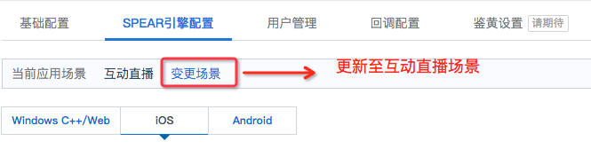
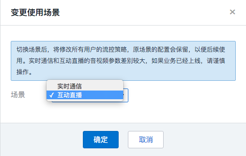

下面结合随心播分开介绍直播与互动直播的SPEAR配置。

## <a name="DevelopSpearLiveConfig">直播SPEAR配置</a>

直播时，需要配置主播与观众角色两个角色如下：

**主播配置**： 
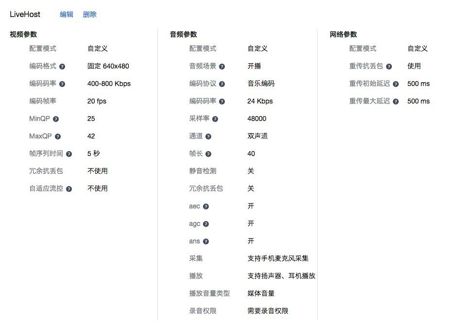

**观众配置**： 
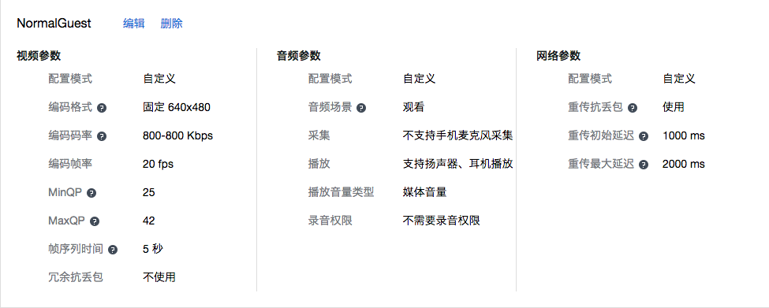

## <a name="DevelopSpearMultiLiveConfig">互动直播SPEAR配置</a>

**主播配置**： 

**普通观众配置**： 
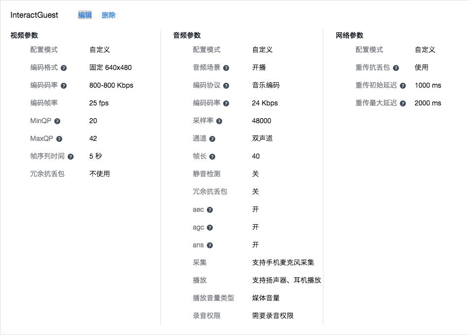

**互动观众配置**： 
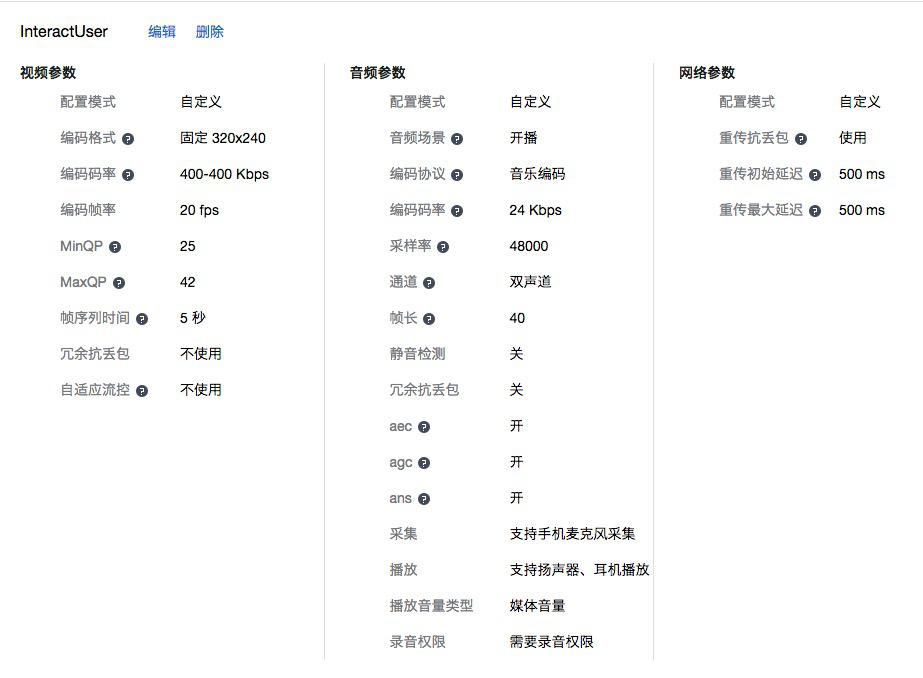

**三者区别**： 

主播：要保证主播的画面质量（主要见视频参数编码格式要高些）以及直播质量（见网络参数，时延较小）；

观众：其视频参数对其影响不大，主要是要将其时延配得相对较大些；

互动观众：其相对于主播画面质量要小些，时延与主播一致；

## 直播/互动直播配置对比说明

由上面的图配可能看出，直播/互动直播主播配置是没区别的，互动直播对比直播多一个互动观众配置，二都的主要区别在于观众的配置中的音频场景不一样：

直播观众：使用观看（不能开Mic）；

互动直播观众：使用开播（可以开Mic）；

二者不同的原因在于：

-   音频场景确认后无法修改，进房间时设定，使用过程中不能修改；

-   <a name="DevelopAppointInteractUser">因随心播业务逻辑导致：随心播中主播在互动直播时可以向任意观众发起上麦邀请，所以观众必须配置成开播模式，才可以进行上麦。</a>（各业务App此处可以根据具体业务来决定：互动直播时观众是否使用开播模式，后续<a href="#DevelopCreateRoom">*创建房间对象*</a>有作说明）；
    
    导致的问题：
    
    使用观看模式时，观看直播时，手机使用的是扬声器音量，按侧边键可以静音；
    
    使用开播模式时，观看直播时，手机使用的是通话音量，按侧边键不可以静音；

**另外请记住配置中使用的角色名（直播：LiveHost，NormalGuest；互动直播：LiveHost，InteractGuest，InteractUser），后续代码中会用到。**

如果不配置这些角色，或后续代码中使用了与配置的角色名不对的角色（如主播SPEAR配置为LiveHost，但是实际代码误写成Host），则使用默认生成的user，可能会影响到计费，请开发者注意。

# <a name="DevelopCreateRoom">创建直播间对象</a>

为方便用户进行定制，TCAdapter中的直播间协议，业务方只需要在其对应的数据模型上实现该协议即可传入到TCAdapter中进行使用； 
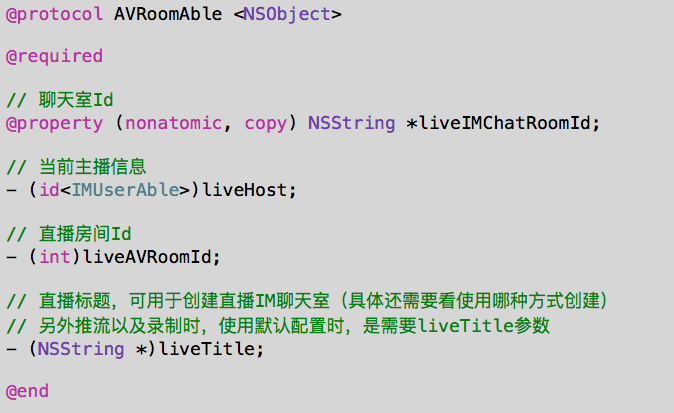

如果本地没有直播间数据模型，且又想对直播间模型进行功能扩充，可参考随心播中的TCShowLiveRoomAble继承AVRoomAble进行协议补充。 
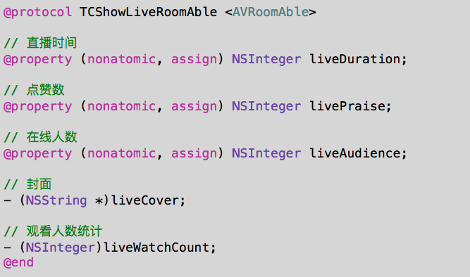

同时声明TCShowLiveItem来实现扩充的TCShowLiveRoomAble协议。 
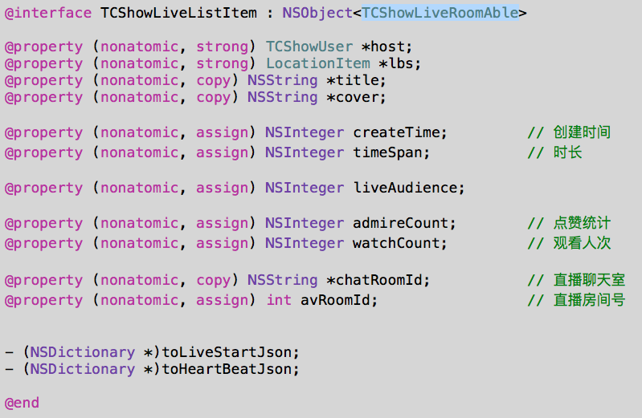

对于前面所说的互动直播时，<a href="#DevelopAppointInteractUser">*如何指定互动观众*</a>，即可通过类似方式来扩展AVRoomAble接口（添加设置互动观众列表接口），然后作对应的实现即可。

另外直播间的管理属于业务逻辑，<a href="https://github.com/zhaoyang21cn/SuiXinBoPHPServer">*随心播后台*</a>提供的公供参考。

其他可参考TCAVIMDemo中的TCAVRoom对象直接实现AVRoomAble协议即可： 
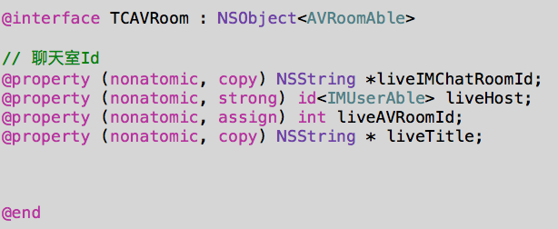

# <a name="DevelopEnterLive">进入直播/互动直播</a>

**TCAdapter已将创建直播/互动直播流程进行封装，用户只需要清楚好自己的业务类型（直播或互动直播），然后选择对应的TCAdapter中的类进行继承，即可快速进入到直播间，不用自行处理原先的复杂流程。**

此节以随心播创建直播、互动直播为例，教大家如何快速开发并进行直播：

## <a name="DevelopAddLiveController">添加直播/互动直播界面对象</a>

**首先根据自己的业务类型选择TCAdapter中具体的类进行继承。**

如果是做直播，可继承TCAVLiveViewController 

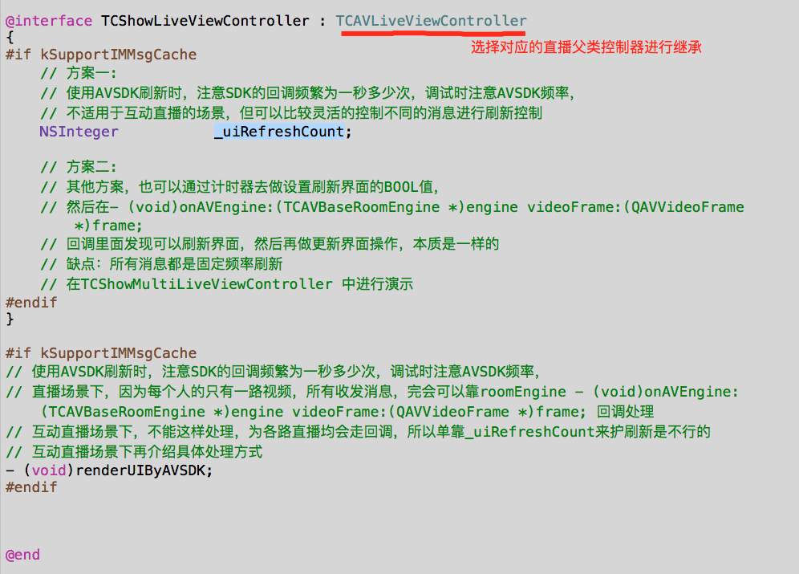

如果是做直播互动直播，可继承TCAVMultiLiveViewController 

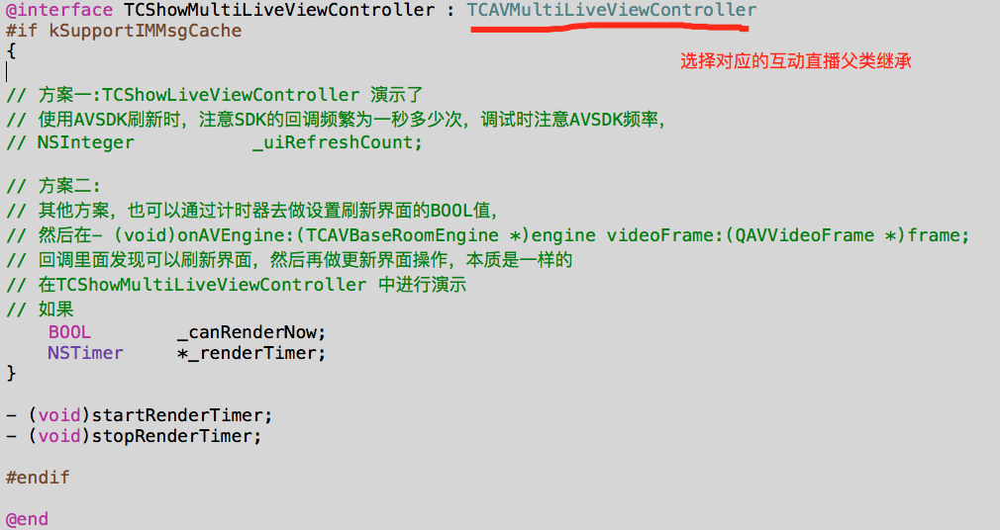

### <a name="TCAdapterEnterLiveFlow">创建直播/互动直播</a>

1.  创建直播间，并配置参数；

2.  创建刚添加直播、互动直界面类，并传入直播间参数，以及当前用户的信息；

3.  跳到直播界面；

    （图片中的代码来源于TCShow下的PublishLiveViewController.m）

    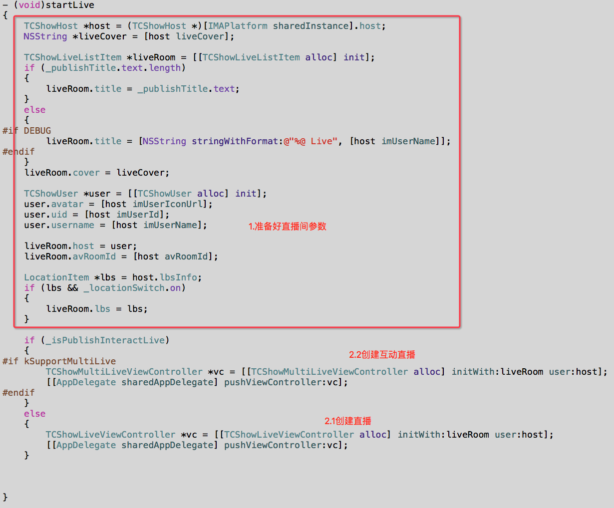

### 加入直播/互动直播

在直播列表界面，显示的是当前在正在进行直播的直播间信息，随意点进一个即可进行观看直播，结合<a href="#TCShowStartLive">*上图*</a>与<a href="#TCShowEnterLive">*下图*</a>，我们可以发现加入直播间与开始直播间流程是统一的，即为<a href="#TCAdapterEnterLiveFlow">*上述*</a>。

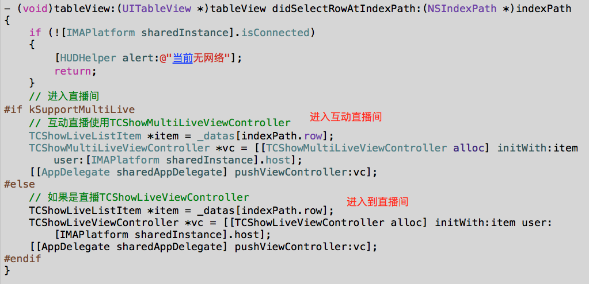

### 注意事项

创建直播、互动直播时，传入的当前用户参数有作参数检查，如果没人实现对应要求的协议会抛异常，这可能会导致程序崩溃。 
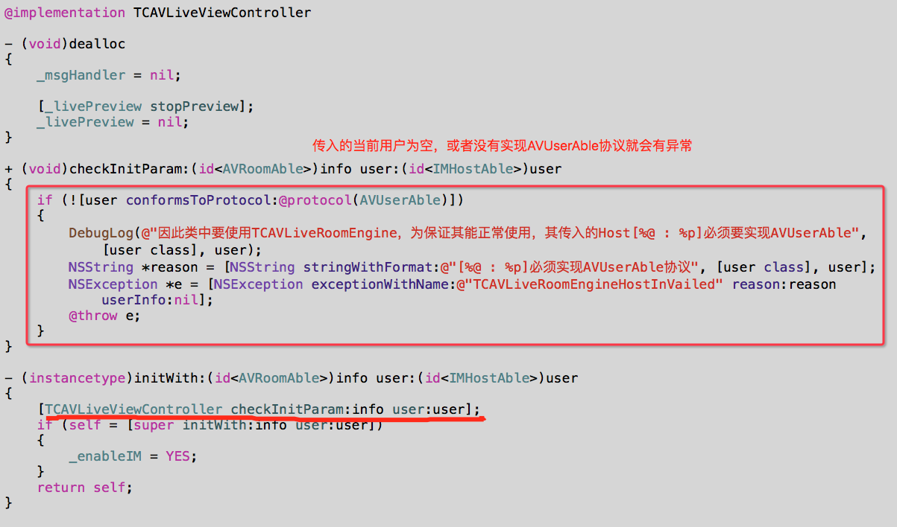 
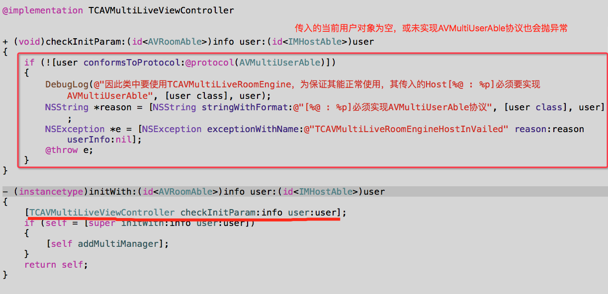 

而IMAPlatform中默认的IMAHost己实现该协议，在<a href="#DevelopInitIMSDK_ConfigIMAPlatform">*前面*</a>我们有介绍，可以指定Host具体的类型必须为IMAHost子类，所以其实在创建直播我们要保证登录过IMSDK，并<a href="#DevelopInitIMSDK_Step3">*成功拿到用户信息*</a>，保证IMAPlatformHost不为空。 
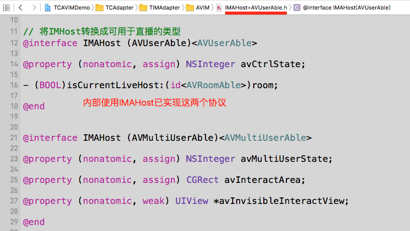

# 进入房间后的配置

在完成上面的步骤后，进入房间还是使用TCAdapter中的默认配置（TCAdapter因为不清楚用户的Spear配置，其内部使用的均是默认配置），所以对应的这块需要用户重写对应的方法进行配置，这样的配置主要以下三处，下南结合随心播配置进行说明：

1.  角色配置：直播引擎配置

2.  权限配置；直播引擎配置，涉及OC/DC机房，会影响计费，请谨慎配置。

3.  进入房间后操作配置；直播界面控制

    在<a href="#DevelopEnterLive">*上一节*</a>中，我们创建了属于自己业务的直播界面，但是使用的时候发现其中配置的直播引擎不符合我们的要求，那如何进行处理？

    在<a href="2.架构集成.md?#TCAdapterArchitecture">*TCAdapter模型*</a>中，我们知道每个直播界面控制器都有一个直播引擎，我们需要指定该创建配套的直播引擎即可。

    下南以随心播为例，讲解如何接入自定义引擎；

## 接入自定义直播引擎

1.  创建自定义引擎：这里主要根据自身业务（直播、互动直播）去选择对应的类继承，直播继承TCAVLiveRoomEngine，互动直播继承TCAVMultiLiveRoomEngine 
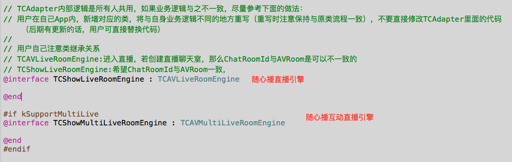

2.  接入自定义引擎：重写<a href="#DevelopEnterLive">*上一节*</a>中创建的直播控制器类的createRoomEngine方法。可以通过对比发现，重写的时候我们只需要换将引擎类型名换成第一步创建的自定义引擎类即可。随心播直播引擎重写： 
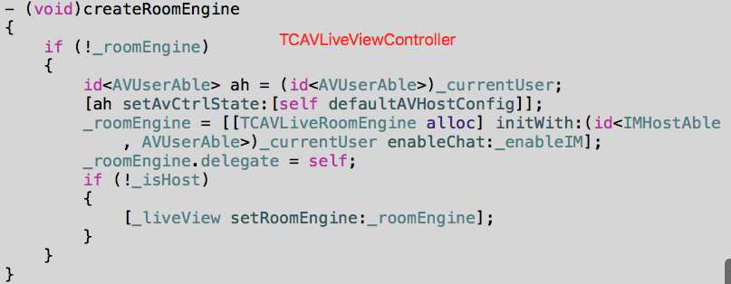
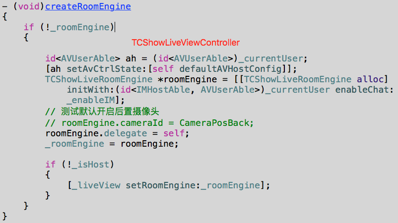
 随心播互动直播引擎重写：  
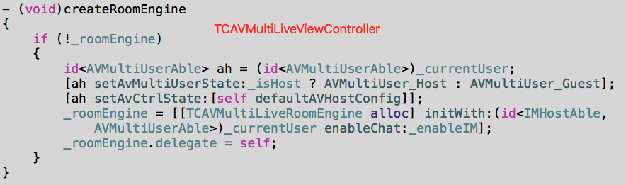
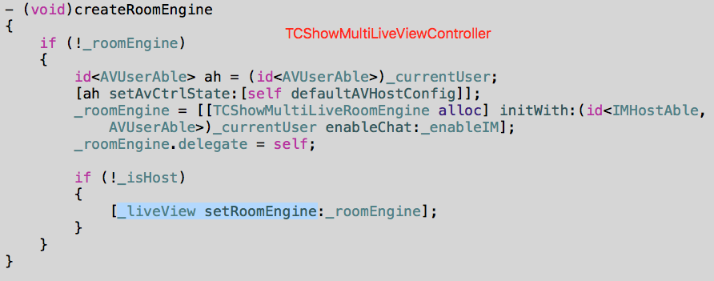

## <a name="DevelopConfigRoleAuth">配置角色权限以扩进房间后的操作</a>

1.  角色配置（进入房间前配置）：TCAdapter默认使用角色为空（即为Spear中默认的User，<a href="#DevelopSpearConfig">*详见Spear配置说明*</a>），用户根据<a href="#DevelopSpearConfig">*前面的平台配置说明*</a>以及结合自身业务逻辑（比如前面所说的<a href="#DevelopAppointInteractUser">*如何指定互动观众*</a>，在此处则要配置互动观众的角色，随心播里面只配置两个是因为其业务逻辑中的互动用户是在进房间后指定的，后面会介绍如何<a href="4.直播中的功能点讲解.md?#ConnectShowFlow">*邀请上下麦*</a>中会介绍）进行重写roomControlRole方法；
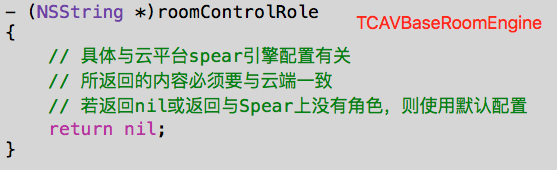
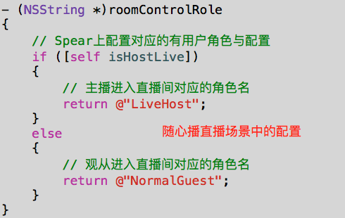
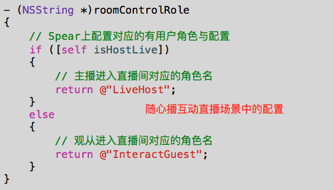

2.  权限配置（进入房间前配置）：TCAdapter默认进入房间的配置是主播权限全开，观众只有加入房间以及接收权限，随心播中默认使用该配置，即没有重写该方法。此处配置依然要结合用户自身业务逻辑去重写roomAuthBitMap方法。 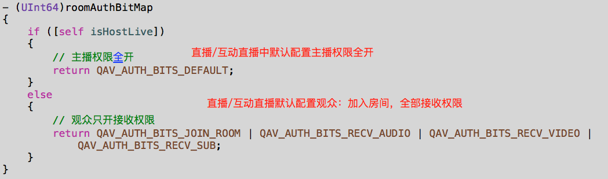

    比如TCAVIMDemo中的二人视频电话Demo中，通话双方进入都可以打开摄像
    头以及Mic，进入的配置即为权限全开； 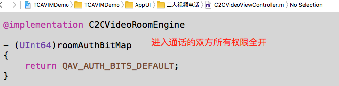

    TCAVIMDemo中的二人语音电话Demo中，通话双方进入后只用打开Mic，扬
    声器，进入的配置即主要是配置音频接收与发送权限； 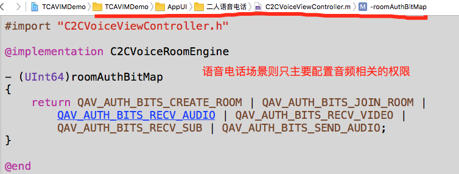

3.  进入房间后的操作（进入房间后配置）：TCAdapter中将一般进入房间后常用的操作又容易出错的地方进行了封装，这些操作包括：打开摄像头，麦克风，扬声器，美颜，推流，录制，美白等。角户进入房间时，只需要配置相应的操作，TCAdapter中默认为将其执行，不需要用户自行写代码进行操作，具体指定时，只需要重写直播界面控制器的defaultAVHostConfig方法。操作对应的操作命令字如下： 
    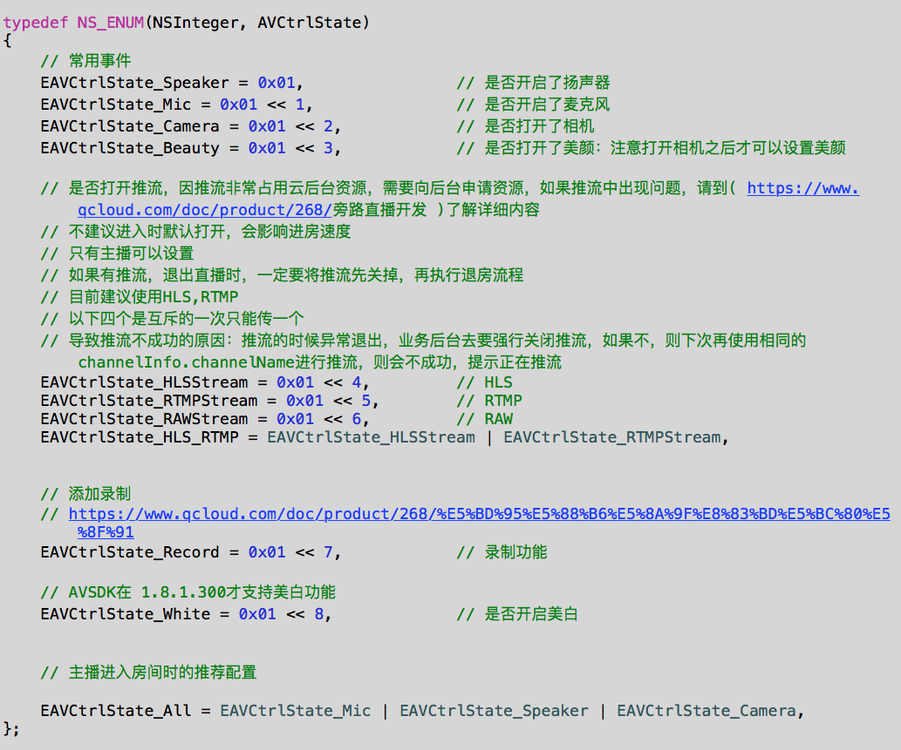

TCAdapter中的默认权限配置如下，随心播直播、互动直播都是使用这一默认配置。 
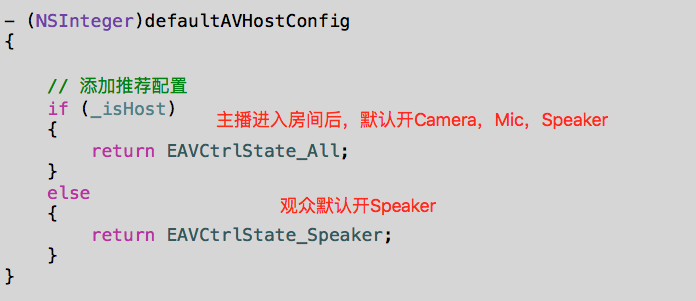

下面以TCAVIMDemo中的二人语音电话，以及二人视频电话作讲解：语音电话，
通话双方只用开Mic，Speaker，而视频电话则还要开Camera 

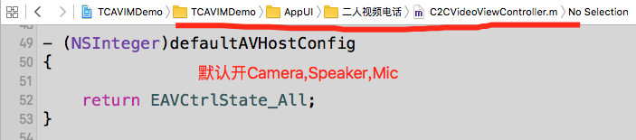

更多重写细节可参考<a href="4.直播中的功能点讲解.md?#CustomEnterRoomFlow">*进房间流程定制*</a>。

# 退出直播/互动直播

TCAdapter已将退出直播/互动直播流程进行封装，对应的方法好下，请注意阅读注释。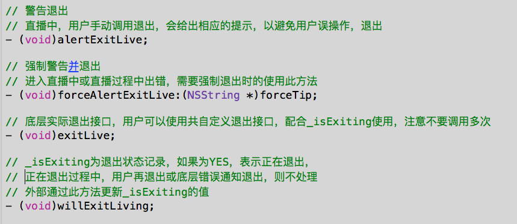

*退出房间后，注意检查资源是否及时释放*，如果未及时释放，有可能会导致下次直播的时候出错。目前Debug模式下，TCAdapter中退出时会打印出相关的释放日志，用户在开发调试时，请关注该日志，以检查自己添加的代码是否导致资源未释放问题。

随心播直播资源释放日志： 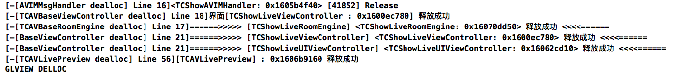

随心播互动直播资源释放日志： 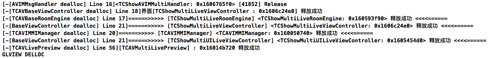

# 业务UI集成
TCAdapter直播界面控制器将直播画面渲染与用户UI进行了分离，用户可以在其用户UI中操控底层的直播界面控制器，用户可通过下面的两种方式集成自已播UI（注意修改backgroundColor为透明），**不推荐直接在前面自定义的直播控制界面上添加控件**。

1.  对于新接入的用户，可创建UI界面继承TCAVLiveBaseViewController，在其基础上添加自身App的业务逻辑，随心播中使用这种方法进行； 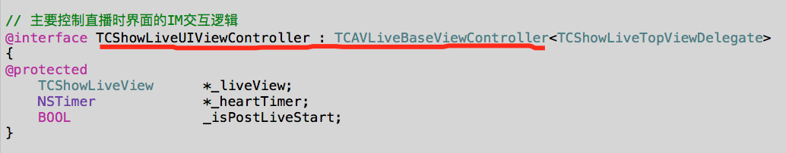

2.  对于已有直播界面的用户，可以让其界面实现TCAVLiveUIAble协议，TCAVIMDemo中二人视频电话示例中使用这种方式； 

    TCAdapter中默认使用第一种方式，在直播界面控制器上添加了一个透明的无任何内容的UI控制器。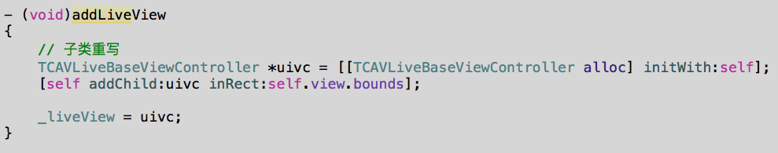
   
   完成上面的任意一步时，在自定义的直播控制器内重写addLiveView方法，以随心播为例，重写addLiveView方法后，自定义直播控制器上即可显示自定义的UI交互界面了。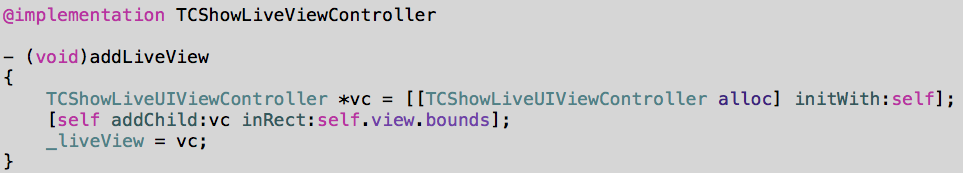

 **注意事项：** 
    用户在其自定义的UI界面调用直播界面控制器时，需要注意内存问题，否则会出现<a href="#退出资源释放">*上述问题*</a>，通常此处相关的操作有：

-   Block使用不当，导致循环引用；

-   计时器未正确释放；

-   其他会导致内存延迟释放相关的操作；

    用户在写自定义UI界面的逻辑时，需要谨慎处理，避免<a href="#退出资源释放">*上述问题*</a>。

# 自定义渲染控件

TCAdapter中的直播渲染控件为TCAVLivePreview，互动直播渲染控件为TCAVMultiLivePreview，其内部更侧重于如何将正确将画面如何正确显示出来，而非过多研究怎么展示才好看（横竖屏如何显示），这一块更多地与业务逻辑相关，用户如果觉得画面渲染这块不能符合自身App的需求，可以自定义渲染控件，以及画面分发控制，以达到自身的要求。

TCAdapter直播控制器内配置渲染控件的方法为addLivePreview 
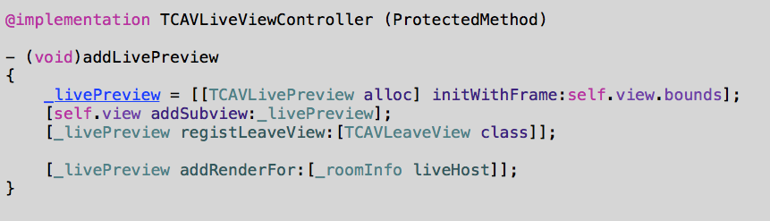 
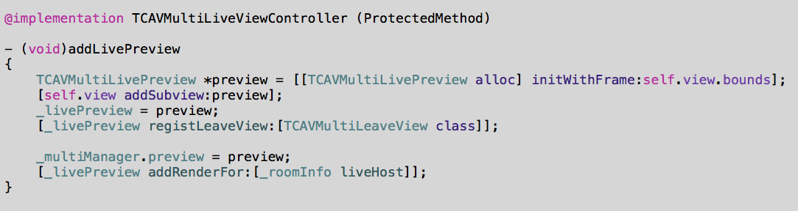 

随心播中没有自定义此处，可参考**TCAVIMDemo中的下的“修改渲染控件，控制全屏示例”**：

1.  自定义界面分发器； 
	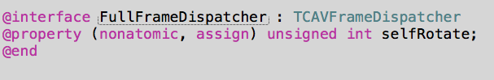

2.  自定渲染控件中使用自定义的分发器； 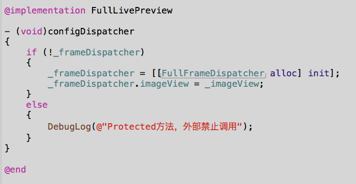

3.  重写直播控制器的addLivePreview方法，添加自定义的渲染控件； 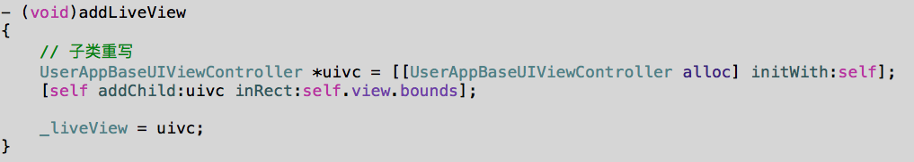
