# 直播中的功能点讲解

**该部份主要讲解实际操作中，用户需要关注或可能需要重写的逻辑，这一节内容也是用户比较容易出错的地方。用户在重写以下这些方法时，注意保证逻辑的完整性。另外此章节会根据技术支持群反馈的问题持续更新。**

## 硬件权限以及网络检查

### 进入前检查

1.  进入前网络检查：TCAdapter中的网络通知回调是IMSDK返回的，IMAPlatform对其作如下封装： 
	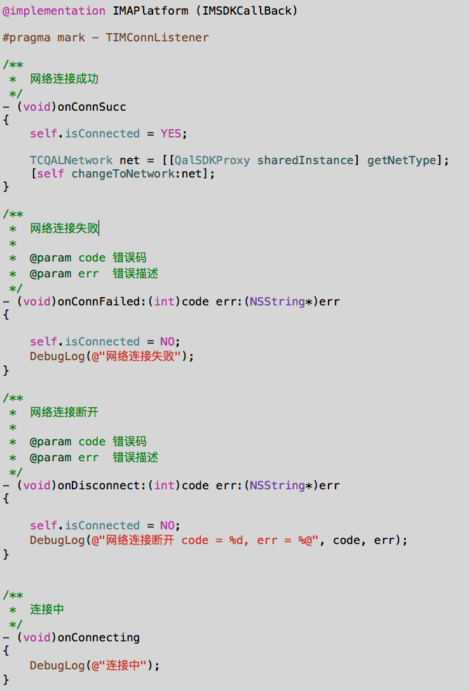

    外部用户如果也想用这一通知，其前提是要执行<a href="3.开发指南?#DevelopInitIMSDK_ConfigIMAPlatform">*这一步*</a>中的configIMSDK，然后在其代码中KVO网络变化。 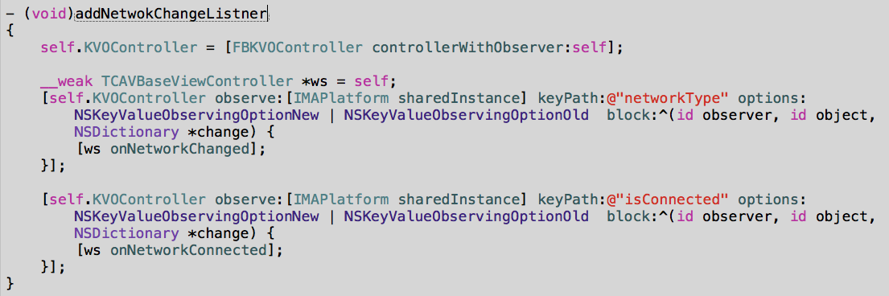

    TCAdapter内部直播前网络检查接口如下：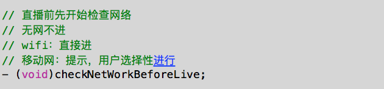

2.  进入前手机权限检查：权限检查主要相机与麦克风的权限检查，检查的时候会区分不前用户是主播还是观众，同时也跟Spear配置有关。

    TCAdapter中主要是对直播场进行了封装，默认的逻辑是：主播进入时（还未到调用AVSDK相关代码）要检查相机与麦克风权限（**但对静音，以及勿扰模式不作检查，这一块会影响音频上行，请开发者注意**），观众进入时不检查这些权限。

    但是如果进入时Spear配置音频场景为开播模式时，使用AVSDK，进入房间后，其底层会检查麦克风权限（比如：随心播中互动直播，观众进入时配置的是开播模式，首次使用时使用提麦克风权限检查）。 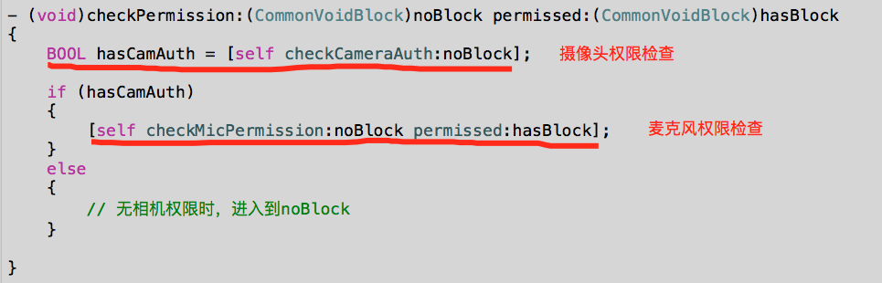

    实际使用时，用户根据自已业务场景与TCAdapter中的一不致，可重写上图中的方
    法即可。

### 使用中检查

1.  使用过程中，如果用户手动去手机设置项是修改了权限，这样会导致使用到对应权限的App重启，这是系统机制。所以TCAdapter使用过程中不再对相机与麦克风权限作检查。

2.  使用过程网络变化监听：TCAdapter中监听了网络断开/连接变化通知（onNetworkConnected），以及网络类型（wifi/移动网络/无网）变化通知（onNetworkChanged），并提供较简单的处理，用户重写这两处以满足自定义效果。

# <a name="CustomEnterRoomFlow">进房间流程定制</a>

前面介绍过用户集成时，<a href="3.开发指南?#DevelopEnterLive">*用户进直播间*</a>时，需要关注的主线流程，下面的几点可能也是用户会关注的，用户根据实际需要进行重写。

- 能否不立即进入直播间：TCAdapter默认直接进入到直播间，如果用户需要在进入直播界面，需要做一些自定义的操作之后再进行，可以重写下在的接口： 
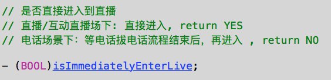

- 直播聊天室是否必须创建：TCAdapter中默认enableIM为YES，用户进入时会根据传入的直播间参数信息中的liveIMChatRoomId去作创建/加入直播聊天室的操作，对于一些业务场景下，用户不需要聊天室操作，或外部已经有聊天室的情况时，可以通过下图红框中的参数进行设置，注意阅读注释。 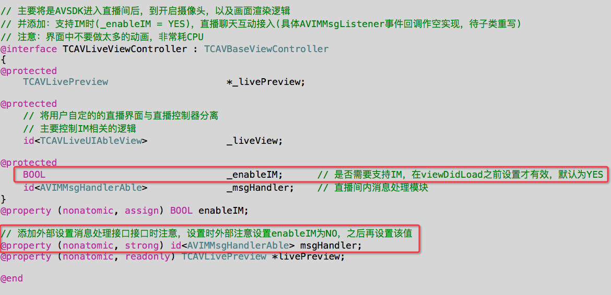 同时如果自定设置时，注意根据具体情况设置消息的回调处理，此处可能有调试工作，用户谨慎处理。

- 美颜、美白默认参数自定义：TCAdapter中如果在<a href="3.开发指南.md?#进入房间后配置操作">*进入房间后配置*</a>中配置了自动开启美颜或美白（前提是必开相机才有效），进入房间成功后，在打开相机后，会默认对应打开美颜或美白，此时二者对应的默认值均为5，用户可在其<a href="3.开发指南.md?#自定义直播引擎">*自定义引擎*</a>中可重写该值： 
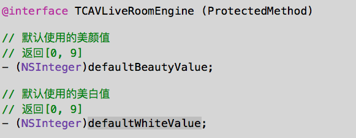

- 退出时能否不解散/退出聊天室：TCAdapter中的直播场景在退出直播间后，会默认退出群，但对于一些非直播业务场景下，用户并不想这么做，这时用户可在其<a href="3.开发指南.md?#DevelopAddLiveController">*自定义直播界面控制器*</a>重写以下方法： 

# 推流/录制

TCAdapter中推流相关的代码在TCAVLiveRoomEngine+PushStream中，录制相关的代码在TCAVLiveRoomEngine+Record。TCAdapter中默认会管理推流操、录制操作：正常退出时，会自动结束推流、录制，使用过程中也可以手动停止。但异常退出时，业务端需要到后台手动关闭相关的操作；当然用户也可能参考此部分的代码，进行重写，或**自行实现，自行实现时注意退出直播时，一定要关掉对应开启的推流与录制。**

## 推流设置

目前代码中支持两种方式让主播开启推流

1.  启动过程中配置：在进房间后，像其他开Mic，Camera一样配置即可，退出时，TCAdapter自动检查是否有： 
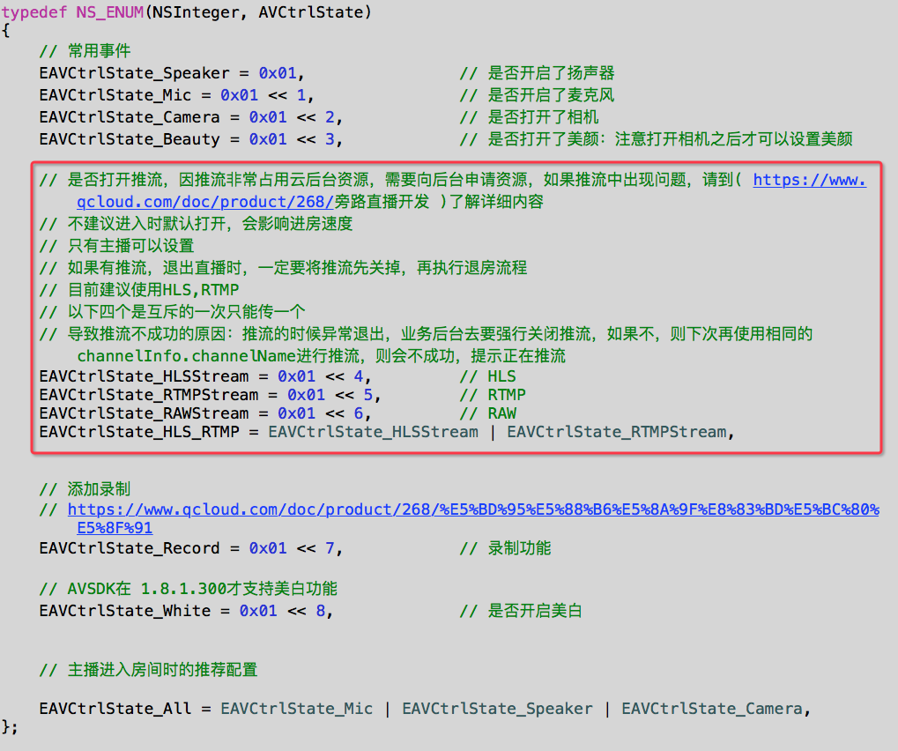
 
代码中进行监听推流回调（详见TCAVRoomEngineDelegate）；
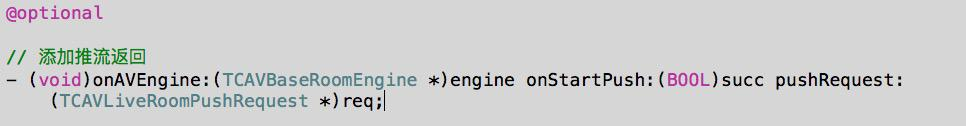

2.  用户手动调用开始与结束推流代码； 
	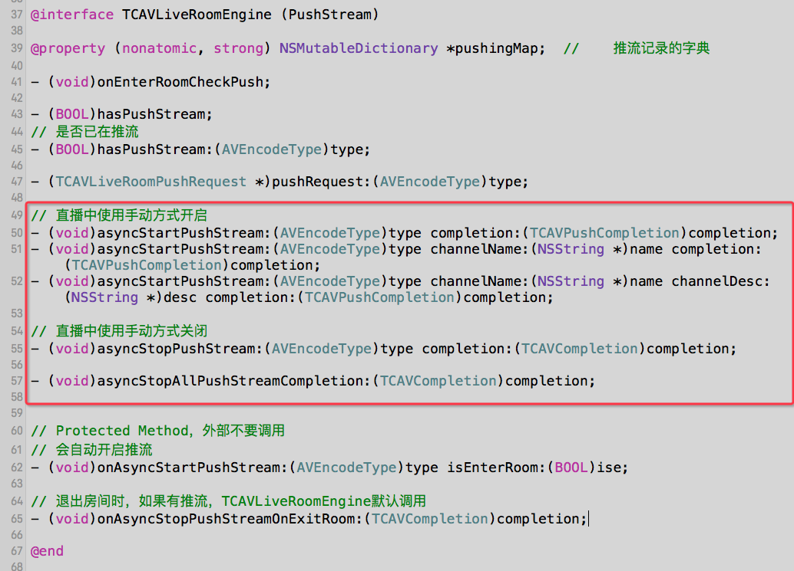

    **注意启动时配置时，推使用观察者回调，直播中使用block回调；**

## 录制设置

录制相关的代码在TCAVLiveRoomEngine+Record中，目前代码中支持两种方式让主播开启录制：

1.  启动过程中配置：在进房间后，像其他开Mic，Camera一样配置即可（同上推流处中使用EAVCtrlState\_Record）代码中进行监听录制回调（详见TCAVRoomEngineDelegate）； 
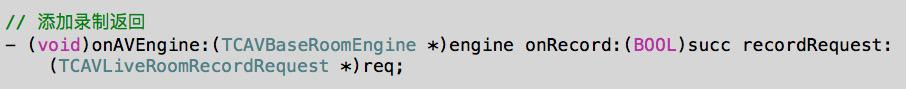

2.  用户手动调用录制代码； 
	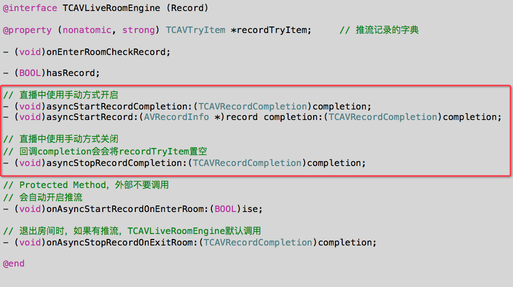

    **注意启动时配置时，推使用观察者回调，直播中使用block回调；**

# 中断处理

## 电话中断

TCAdapter中进入直播间成功后会添加电话监听(addPhoneListener),App在前台直播中如果有电话中断，其会自动进行处理（handlePhoneEvent）：被电话中断时，会切换到电话界面，相当于App会进行退后台处理，电话结束时，App自动切换到至前台，进行前台处理。 
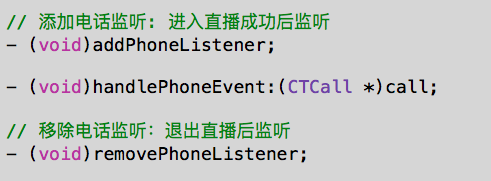

## 前后台切换

直播过程中，前后台切换事件处理（此处说明一下子类有对此事件进行重写） 
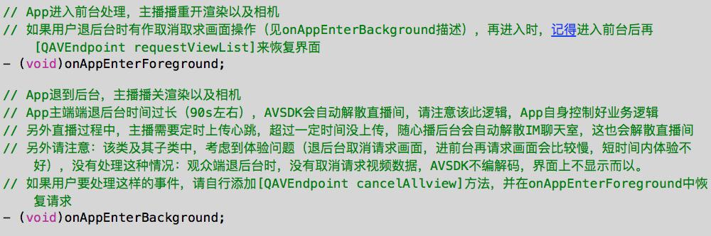

用户在开发自己的App过程中，经常反馈会退后有声音无画面问题，而随心播没有，原因随心播没有配置后台模式，而用户的App配置了后台模式导致。当用户App有后台模式的时候，TCAdapter中默认会在前后台切换时，会执行开关mic操作，来处理这样的逻辑。用户若想让其退后台仍可声音可重写该方法（有后台模式的前提下），可让自己的app在退后台仍可继续进行录音。 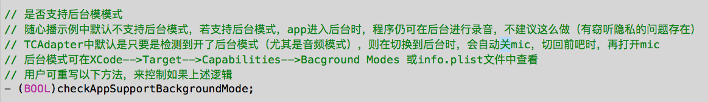

## 音频中断

直播过程中有可能会有输入法，闹铃，或其他音频相关的中断，TCAdapter中，会添加相关的中断监听，并统一在下图的代码中进行处理了。 
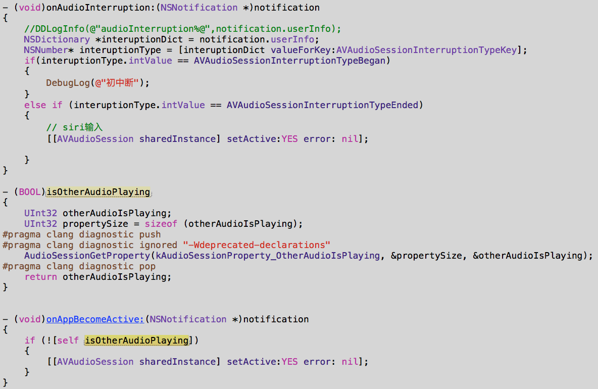

另外需要注意的是：在进入房间前的会记发当前的AVAudioSession中相关的参数，以便离开房间时，可以恢复到进入前的配置。

## IM互踢

使用过程中，如果用户帐号在其他手机上登录了并开启直播的话，会导致直播时画面出错。所以在TCAdapter里面，当我们进入到TCAVBaseViewController中是，重新要设置IMSDK的TIMUserStatusListener监听者为自己（之前是IMAPlatform）。 

直播结束时，再设置回IMAPlatform 
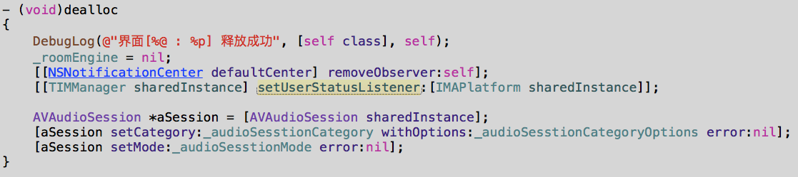

直播中处理互踢以及sig过期等操作 
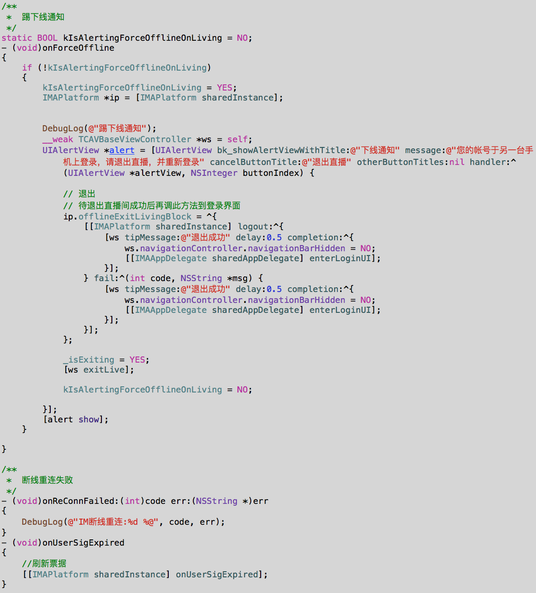

# <a name="ConnectShowFlow">上麦/下麦流程</a>

上麦/下麦是互动直播才用到，用户上麦流程:

1.  本地检查手机是否有使用Camera/Mic权限，如果没有权限不能进行后续操作；

2.  修改权限；

3.  修改Role(NormalGuest--&gt;InteractUser)；

4.  前两步操作完后，再打开camera/mic；

用户下麦流程：

1. 关camera/mic

2. 修改权限

3. 修改Role(InteractUser--&gt;NormalGuest)

TCAdapter中对此流程进行了封装，用户可根据自己的业务逻辑，要上麦的用户，在合适的时机调用以下接口进行上麦。
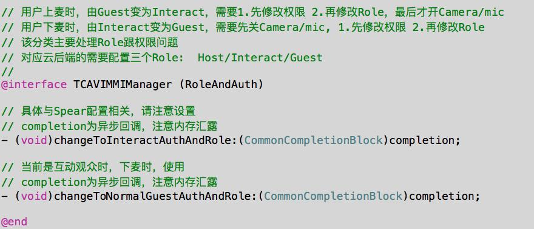
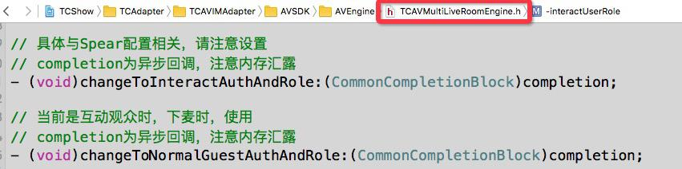

具体流程请搜索代码中上图中的函数。

# <a name="LivePerformanceOptimization">性能优化</a>

当主播端短时间内收发大量消息时，如果采用即时显示，那么消息的显示会抢占CPU，无法保证AVSDK采集以上行数据
，这样观众端看到的画面会有卡顿，

关于大量收到IM消息时性能调优原则：

1.  减少IM消息显示频率:将IM消息进行缓存（或IM消息合并），以固定频率进行刷新；

2.  减少界面上的动画，增加动画缓存：

3.  在AVSDK回调中进行刷新：

4.  IM消息在显示前，先在子线程中将要显示的内容先计算出来，不要等到主线程中计算；

5.  界面上使用性能更好的代码；

    如何验证：使用WorkSpace中的LiveIMTool，配置成与App相同的Appid，然后用LiveIMTool加入到相同直播聊天室，输入参数控制发消息间隔，然后查看大消息下的效果，并进行性能调化。 
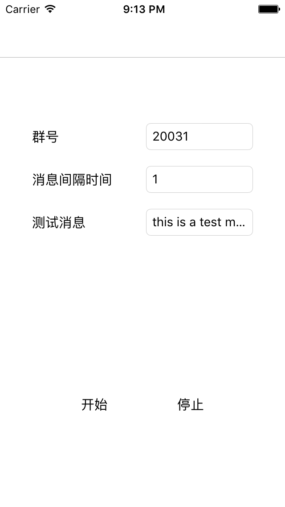

用户也可参考该LiveIMTool的代码，自己写测试代码进行验证。

另外请注意目前直播中使用的是AVChatRoom是有频率控制，具体参数设置请咨询IMSDK技术支持。

Demo中支持立即显示与缓存后显示，详见编译宏kSupportIMMsgCache，用户可通过修改此值，并与LiveIMTool结合进行，可检查大消息量下自己App是否有卡顿效果。
