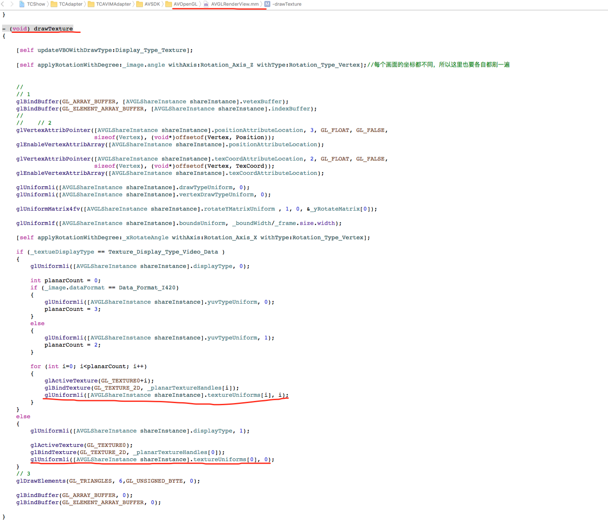
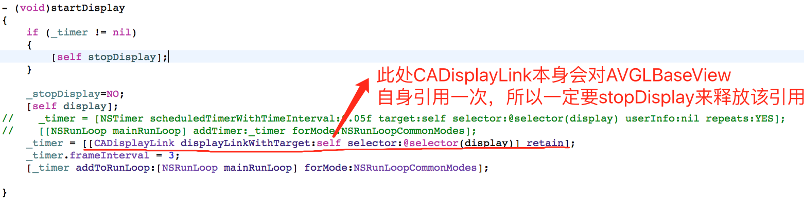
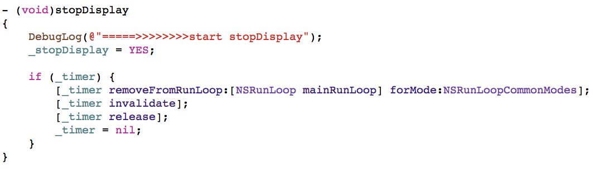
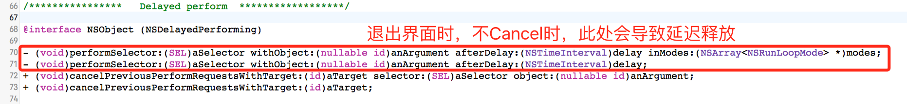
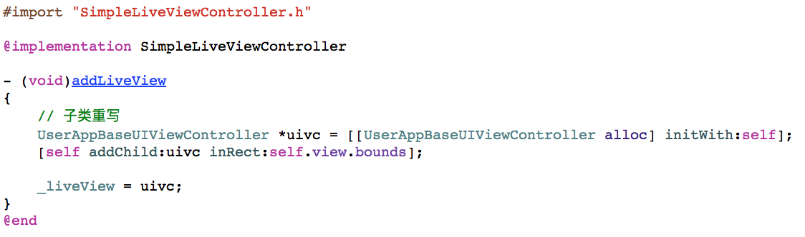
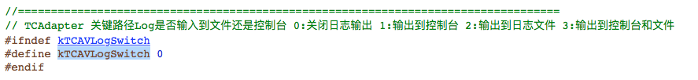

# 原因分析

当使用AVSDK中默认的AVGLBaseView作为直播渲染时，从之前调试以及用户反馈的情况来看，通常导致crash的地方是：<font color="red">**OpenGL在上一次没有正确得到释放，下一次使用过程中crash了;**</font><br>，其表象是crash到AVGLRenderView中的drawTexture下图中标线处，报野指针错误:<br>


## 为什么是在下一次使用中出问题

通常的原因有如下几点：<br>
1. 代码中有循环引用：<font color="red">**通常表现在block使用不当，或计时器处理不当，以及其他常见的内存引用问题，导致没有释放或延迟释放；**</font><br>
2. 切换前后台处理不当：直播过程中的前后台切换（尤其是频繁切换时），以及对电话的处理不当，导致AVGLBaseView startDisplay或stopDisplay的时机不对，其本质上还是第一条，下面会解释；<br>
3. 调试过程中AVSDK太久没上传心跳（>30s），直播过程中被动退出了，然后下次再进的时候也有会导致crash，本质上也属于第一条。通常这种情况下，建议检查AVSDK相关的回调中是否处理得当，此处不多介绍；<br>

真实原因是：
AVGLBaseView底层渲染是通过CADisplayLink（相当于计时器，计时器本身对使用target造成一次循环引用），当我们开始startDisplay时，实际上是循环进行绘制AVSDK返回的QAVFrameData到display屏幕上，display中会间接调用上面说的AVGLRenderView的drawTexture方法<br>

<br>所以在不需要渲染的时候，需要停止该计时器<br>


<font color="red">**因为其底层使用的AVGLShareInstance是一个单例，如果在下一次initOpenGL后，这时上一次的延迟释放了，其会调用destoryOpenGL，导致在display的时候crash。**</font>

以TCAdapter为例说明以上的问题（其他方式接入的可参考）：<br>
代码中显示对AVGLBaseView**直接强引用**的有：
1. QAVSDK返回的视频帧（QAVFrameData）分发器，如TCAdapter中使用的TCAVFrameDispatcher，目前TCAdapter是是将其封装到TCAVLivePreview中，即如果TCAVLivePreview;
2. 将AVGLBaseView添加到直播界面的self.view，即当前直播界面，如TCAdapter中的TCAVLiveViewController及其子类：<font color="red">如果外部对直播界面强引用了，同样会造成AVGLBaseView释放不成功（即OpenGL得不到正确的释放）</font>;

<font color="red">同样如果业务侧代码对直播界面强引用了，也会间接导致AVGLBaseView无法正常释放</font>


# 如何排查crash

## 接入前验证

1. 如果是刚接入:<font color="red">在查内存泄露问题上，接入时建议步步为营，确保每一步都没有问题，ARC不是万能的，这块出了问题，确实不好查，到后期代码量大，相关的逻辑就多了，就更不好查</font>。接入前最好先验证一下TCAVIMDemo里面的简单直播例子;
<a name="BasicSyntaxCheck">
2. 提前了解下Objective-C通常哪些地方会导致循环引用：建议先谷哥度娘一下，避免真正开发的时候踩坑：最为常见的例子有：NSTimer没有invalidate，以及下面的方法使用不当，导致延迟释放：；<br>
	
	
3. 对Block使用注意事项要了解：堆类型、栈类型、全局类型这三种Block使用注意事项要有清楚（<font color="red">这里不注意，经常会导致延迟释放或不释放OpenGL</font>）： 直播界面内的block最保险的方式如下：block内涉及直播界面，以及内部的变量全部用__weak,
</a>
> ```
> // 以下为伪代码，用户可参考仿照此伪代码写真实代码进行验证
> class A
> {
> int _mA;
> id  *_md;
> }
> 
> @property (nonatomic, strong) id mc;
> 
> // block调用处
> 
> - (void)print
> {
>  // XXXTool 如果对传入succ中代码块作copy操作（即XXXTool内部将其转成堆类型变量），下面的写法都是不安全的，容易导致内存泄漏，self释放前，必须要把XXXTool内部的保存的堆类型block变量释放
>  // 如果没有copy，即为栈类型变量，如果内部是同步回调succ块还好，如果是异步回调，在异回调过程中，self想释放，其需要等该回调返回之后才可以释放
> 	[[XXXTool sharedInstance] sendmsg:xxxx succ:^(BOOL succ) {
> 		// 下面的代码都有问题
> 		_mA = 10;							
> 		_md = [[NSObject alloc] init]
> 		self.mc = [[NSObject alloc] init];
> 		[self methodB];
> 	}];
> }
> 
> - (void)methodB
> {
> ....
> }
> 
> 推荐的print写法：
> - (void)print
> {
> 	
> 	// 无论在哪种情况下，都使用weak。block块内部不直接使用用当前类self, 或其成员变量（示例中的_mA, md）
> 	__weak typeof(self) ws = self;
> 	[[XXXTool sharedInstance] sendmsg:xxxx succ:^(BOOL succ) {
> 		[ws onSendMessageSucc:succ]
> 		// 此种情况下，这样写是没有关系的
> 		//ws.mc = [[NSObject alloc] init];
> 	}];
> }
> 
> - (void)onSendMessageSucc:(BOOL)succ
> {
> 		// 下面的代码都有问题
> 		_mA = 10;							
> 		_md = [[NSObject alloc] init]
> 		self.mc = [[NSObject alloc] init];
> 		[self methodB];
> }
> 
> 
> ```

## <a name="ReproducibleStempCheck">有必现的crash重现步骤</a>
1. 先验证是否是在第二次时才出现的问题：可在当前直播界面的dealloc方法里面打日志或断点，按重现步骤，第一次退出直播界面的时候，是否立即进入到dealloc里面，由此可判断代码里面是否有循环引用；（如果使用TCAdapter进行集成的，可使用TCAVIMDemo下UserAppBaseUIViewController，然后重写addLiveView方法，然后再用同样的重现步骤检查是否有crash，这样基本可定位是否是业务侧代码出问题，还是TCAdapter中出问题，用随心播作对比验证也可以<br>

）
2. 按上面所说的<a href="BasicSyntaxCheck">检查方法</a>，排查重现步骤上的相关内存相关代码（根据前面反馈的记录来看，大部份是因为业务中的计时器，block使用不当。排查NSTimer在退出直播界面时是否invalidate，block使用不当，可在直播相关的代码中搜索 **^**，即可将当前代码中的所有block全部搜索出来）;
3. 整个代码都进行检查，是否存在其他的crash可能;
4. 如果是当次出现的crash问题，建议对比随心播，用同样的操作检查对比一下，查看两边的使用流程是否一致：（之前遇到过退后台不stopDisplay，然后再进入时crash的）；


## 无必现的crash步骤
1. 找到重现步骤，首先在代码里面各关键节点处(进出房间，前后台切换，以及业务核心逻辑处)加上相关的日志，并保存到文件，在重现过程中，确保日志能正确保存到文件，以便查阅；如果是使用TCAdapter进行集成的，可将下关的开关，改成3，

因此块与业务方逻辑接触比较多

2. 当复现出crash之后，再按照有<a href="ReproducibleStempCheck">必现的crash重现步骤</a>进行排查；


